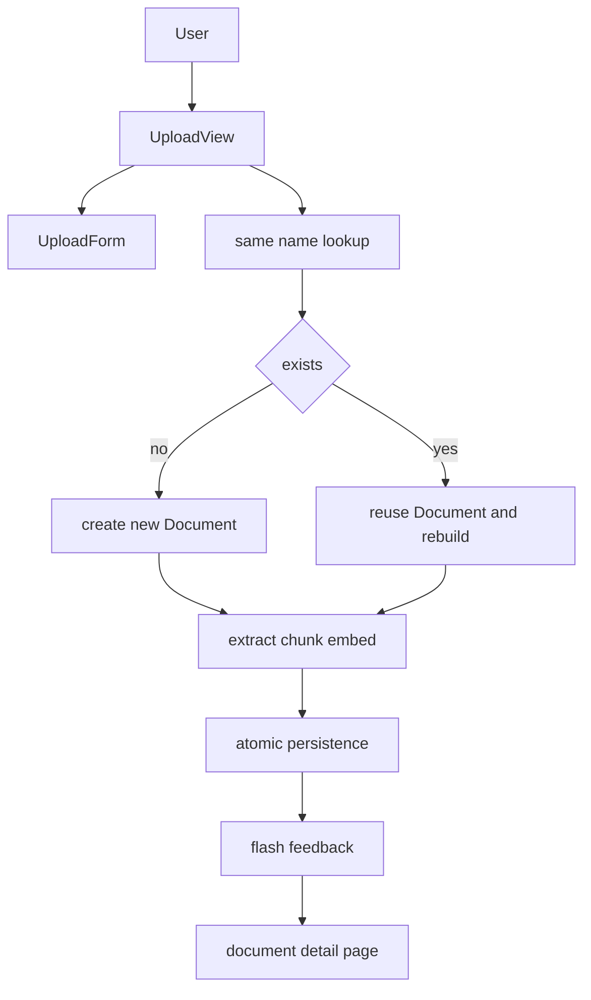
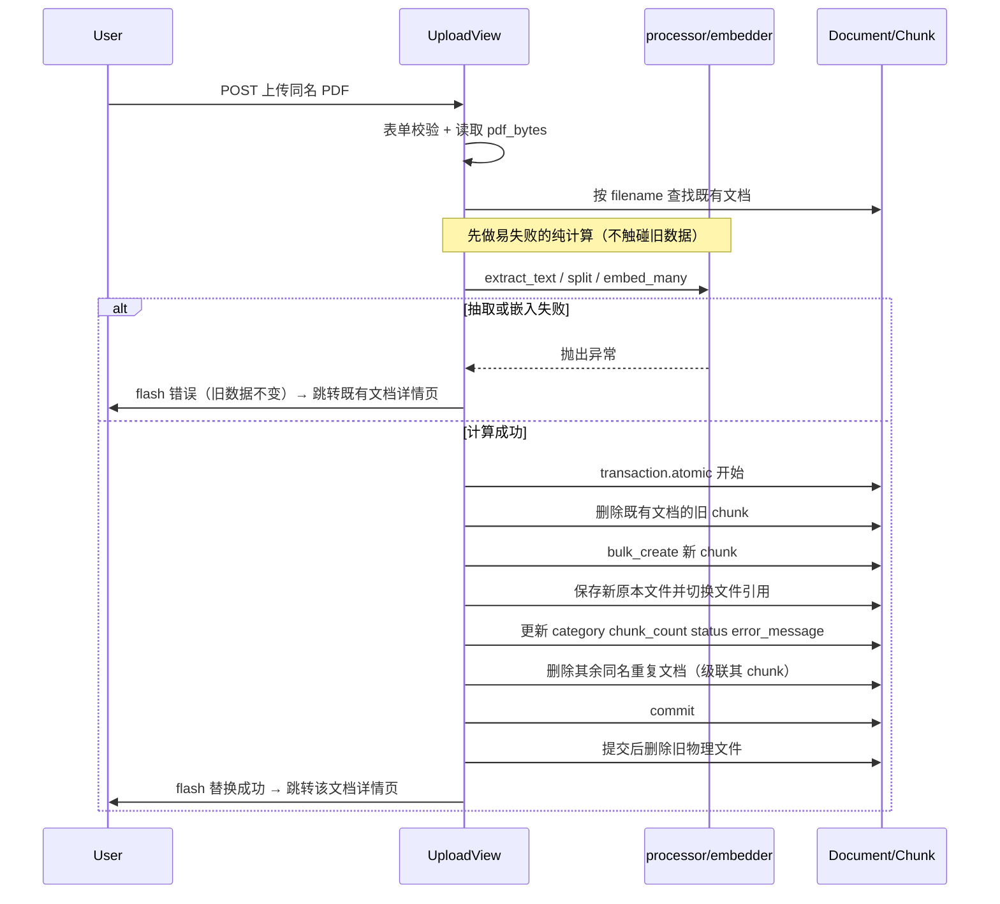

# Design Document — duplicate-upload-replace

## Overview

**Purpose**: 为知识库 PDF 上传引入「同名即替换」行为，向知识库管理者提供「重传同名文件即更新现有文档」的能力，消除重复记录。

**Users**: 通过 Web 界面上传 PDF 的知识库管理者；上传同名文件时期望更新而非新建。

**Impact**: 改变现有 `UploadView.post` 的持久化行为——当上传文件名与现有文档相同时，复用既有 `Document`（保持 document id 不变）、删除旧分块并基于新内容重建，同时更新原本 PDF、种别、状态与分块数；不同名时维持现有「新建」行为。引入 Django messages 反馈，向用户区分「替换 / 新建 / 失败」。

### Goals
- 同名（仅按文件名）上传时替换现有文档而非新建。
- 替换保持 document id 稳定，删旧分块并重建，使检索内容为最新。
- 替换失败时既有文档与分块完好无损（无中间不一致可见状态）。
- 向用户明确反馈本次为替换还是新建，并在失败时给出原因。

### Non-Goals
- 不以文件名以外的依据（内容哈希、大小）判定同名。
- 不将 category 纳入同名判定。
- 不保留被替换文档的历史版本，不提供回滚。
- 不对同名并发上传施加严格锁定/串行化。
- 不为 `Document.filename` 增加数据库唯一约束。
- 不引入上传 API（当前系统无上传 API）。

## Boundary Commitments

### This Spec Owns
- `UploadView.post` 中的同名检测与「替换 vs 新建」分支决策。
- 替换路径的持久化语义：复用 Document 行、删除并重建 Chunk、更新 `file`/`category`/`chunk_count`/`status`/`error_message`、替换旧物理文件。
- 替换路径的失败安全顺序与事务边界。
- 上传结果反馈（替换 / 新建 / 失败）的呈现。

### Out of Boundary
- 文本抽取、分块、嵌入生成算法本身（复用现有 `processor` / `embedder`）。
- 检索逻辑（`searcher`）——本 spec 仅保证替换后旧分块被删除、新分块写入。
- 文档详情页除「反馈消息渲染」外的既有展示逻辑。
- 历史版本管理、并发锁、上传 API。

### Allowed Dependencies
- `knowledge_base.services.processor`（抽取/分块/种别配置）
- `knowledge_base.services.embedder`（嵌入生成）
- `knowledge_base.models.Document` / `Chunk`
- `django.db.transaction`、`django.contrib.messages`、默认文件存储（`FileField` storage）

### Revalidation Triggers
- `Document` / `Chunk` 模型字段或级联关系变化。
- 上传流程改为异步/后台任务（当前为同步请求内处理）。
- 同名判定基准变化（如改为含 category 或内容哈希）。
- 检索层对 Chunk 的消费契约变化。

## Architecture

### Existing Architecture Analysis
- 上传为**同步请求内处理**：`UploadView.post` 串行执行「校验 → 持久化 → ingestion → 跳转详情页」。
- 现有新建顺序为「先建记录/存文件 → 后抽取嵌入」，对新建合理（失败也保留原本 PDF），但**对替换不安全**：必须把易失败的抽取/嵌入放在任何破坏性写入之前。
- Chunk 随 Document 级联删除；物理文件需手动清理（`FileField` 不自动删旧文件）。
- 需保留的集成点：表单校验（`UploadForm`）、ingestion 流程（`processor`/`embedder`）、详情页跳转。

### Architecture Pattern & Boundary Map



**Architecture Integration**:
- Selected pattern: 在既有同步视图内做「检测 → 分支（新建 / 替换）→ 共享 ingestion → 分支持久化 → 反馈」。
- 责任分离：检测与分支、替换持久化属本 spec；ingestion 计算复用现有服务。
- 保留模式：表单校验、`transaction.atomic` 批量写入、跳转详情页。
- 新组件理由：仅新增一个「替换持久化」内部辅助函数与 messages 反馈，最小化变更。
- 依赖方向：View → services（processor/embedder）→ models；不反向。

### Technology Stack

| Layer | Choice / Version | Role in Feature | Notes |
|-------|------------------|-----------------|-------|
| Backend / Services | Django View (`UploadView`) | 同名检测、分支、替换持久化 | 复用现有同步流程 |
| Data / Storage | PostgreSQL + Django ORM；默认 FileField storage | Document/Chunk 读写、原本 PDF 存取 | 无 schema 变更 |
| Feedback | `django.contrib.messages` | 替换/新建/失败的用户反馈 | 中间件已启用，新增模板渲染 |

## File Structure Plan

### Modified Files
- `knowledge_base/views.py` — `UploadView.post`：
  - 在校验并读取 `pdf_bytes` 后，按 `filename` 查找既有文档。
  - 新增内部辅助：抽取+分块+嵌入（共享）；替换持久化（复用行、删旧 chunk、重建、换文件）。
  - 失败安全顺序：ingestion 在破坏性写入前；破坏性写入置于 `transaction.atomic()`。
  - 用 `messages` 反馈替换/新建/失败。
- `knowledge_base/templates/kb/base.html` — 新增 Django messages 渲染区块（供详情页等展示闪现消息）。

> 不修改 `models.py`（无 schema 变更）、`forms.py`、`processor.py`、`embedder.py`、`searcher.py`。

## System Flows

### 替换路径（失败安全顺序）



**关键决策**：
- 抽取/嵌入在事务与任何删除之前完成；失败时直接返回，既有文档与分块零改动（满足 3.1、3.2）。
- 破坏性操作（删旧 chunk、重建、换文件、清理重复）全部在单一 `transaction.atomic()` 内，保证原子性。
- 失败原因经 `messages` 闪现，不写入既有文档的 `error_message`（满足 3.3 同时不违反 3.1）。
- **旧物理文件的删除在事务成功提交之后执行**（`transaction.on_commit`），不放在事务内：存储删除非事务性、不可回滚，若放事务内而事务回滚会误删既有文件。新文件保存与 DB 变更在事务内完成；提交成功后才删除旧文件，从而保证回滚时既有原本文件仍然完好（满足 3.1）。

## Requirements Traceability

| Requirement | Summary | Components | Flows |
|-------------|---------|------------|-------|
| 1.1 | 同名→替换 | UploadView 检测分支 | 替换路径 |
| 1.2 | 不同名→新建 | UploadView 检测分支 | 既有新建路径 |
| 1.3 | 仅按文件名判定 | 同名查找（filename） | — |
| 1.4 | 替换后同名唯一 | 替换持久化（删除其余同名 doc） | 替换路径 |
| 2.1 | 保持 document id | 替换持久化（复用行） | 替换路径 |
| 2.2 | 删旧 chunk 并重建 | 替换持久化 | 替换路径 |
| 2.3 | 更新文件/种别/状态等 | 替换持久化 | 替换路径 |
| 2.4 | 详情页展示最新内容 | 既有详情页 + 复用行 | 替换路径 |
| 2.5 | 检索不再返回旧分块 | 删旧 chunk（级联/显式） | 替换路径 |
| 3.1 | 失败不删不部分更新 | 失败安全顺序 + 事务 | 替换路径(失败分支) |
| 3.2 | 无中间不一致可见状态 | ingestion 先行 + 原子写入 | 替换路径 |
| 3.3 | 失败提示原因 | messages 反馈（不写 error_message） | 替换路径(失败分支) |
| 4.1 | 提示「替换」 | messages.success | 替换路径 |
| 4.2 | 提示「新建」 | messages.success | 新建路径 |
| 4.3 | 跳转详情页 | redirect document_detail | 两路径 |

## Components and Interfaces

| Component | Layer | Intent | Req Coverage | Key Dependencies | Contracts |
|-----------|-------|--------|--------------|------------------|-----------|
| `UploadView.post` | View | 检测同名、分支、反馈、跳转 | 1.1–1.3, 4.1–4.3 | processor, embedder, models, messages | Service (内部) |
| `_ingest`（内部辅助） | View 内逻辑 | 抽取+分块+嵌入，返回 (chunks, vectors) 或抛异常 | 2.2, 3.1 | processor, embedder | Service (内部) |
| `_replace_document`（内部辅助） | View 内逻辑 | 复用行、删旧 chunk、重建、换文件、清理重复 | 1.4, 2.1–2.3, 2.5, 3.1–3.2 | models, transaction, storage | Service (内部) |
| base.html messages 区块 | Template | 渲染替换/新建/失败闪现消息 | 3.3, 4.1, 4.2 | django.contrib.messages | State (UI) |

### View 内部辅助契约（Python 类型注解）

```python
def _ingest(pdf_bytes: bytes, filename: str, category: str) -> tuple[list[str], list[list[float]]]:
    """抽取→分块→嵌入。失败抛异常（破坏性写入前调用）。
    返回: (chunks, vectors)，长度相等。
    """

def _replace_document(
    target: Document,
    pdf_bytes: bytes,
    filename: str,
    category: str,
    chunks: list[str],
    vectors: list[list[float]],
    duplicate_ids: list[int],
) -> None:
    """原子替换：删旧 chunk → bulk_create 新 chunk → 保存新原本文件并切换引用 →
    更新 category/chunk_count/status=complete/error_message='' → 删除其余同名 doc。
    旧物理文件在事务提交后（transaction.on_commit）删除，不在事务内删除。
    前置条件: chunks 与 vectors 已成功生成。
    后置条件: target.id 不变；该 filename 仅余 target 一条；旧 chunk 全部清除；
              事务回滚时既有文档、分块与原本文件均保持替换前状态。
    """
```

- 同名查找：`Document.objects.filter(filename=name)`；目标 = 其一（按 `-uploaded_at` 取首个），其余 id 收集为 `duplicate_ids` 在事务内删除。
- Errors：`_ingest` 抛出的异常在 `post` 中捕获 → `messages.error` + 跳转既有文档详情页（既有数据不变）。

## Data Models

无 schema 变更。复用现有 `Document` / `Chunk`。

- **一致性边界**：替换的破坏性操作（删旧 chunk、建新 chunk、更新 doc 字段、删除重复 doc）构成单一事务聚合，全成或全败。
- **级联**：删除重复同名 Document 时，其 Chunk 经 `on_delete=CASCADE` 一并删除。
- **不变式**：替换后 `target.id` 不变；`filename` 对应有效 Document 数 = 1；`chunk_count` 等于新 chunk 数。

## Error Handling

### Error Strategy
易失败步骤前置 + 事务原子化 + 反馈与持久化分离。

### Error Categories and Responses
- **用户错误（4xx 语义）**：表单校验失败（非 PDF、超限、空文件）→ 复用现有 `UploadForm` 字段级错误，重渲染上传页。
- **业务/处理错误（替换失败）**：抽取无文本（图像型 PDF）、嵌入失败、保存失败 → `messages.error` 提示原因；既有文档与分块保持替换前状态；跳转既有文档详情页。
- **新建失败（既有行为保留）**：新建路径失败仍记录 `error_message`、`status=failed` 并跳转其详情页（不受本 spec 改动影响）。

### Monitoring
复用既有 `knowledge_base` logger；替换成功/失败各记录一条 INFO/ERROR 日志（含 filename 与 document id）。

## Testing Strategy

### Unit / View Tests（`knowledge_base/tests/test_upload_view.py`）
- 上传同名文件 → 不新增 Document 行数，目标 document id 不变（1.1, 2.1）。
- 上传不同名文件 → 新建 Document（1.2）。
- 同名但不同 category → 仍触发替换（仅按文件名判定）（1.3）。
- 替换成功 → 旧 chunk 全删、新 chunk 数 = 新内容分块数、`chunk_count` 更新、`category`/`file` 更新（2.2, 2.3）。
- 存在多个同名历史记录 → 替换后该 filename 仅余一条 Document（1.4）。
- 替换时 `extract_text` 返回空（图像型 PDF）→ 既有 Document 与其 chunk 不变、不写 `error_message`、闪现错误消息（3.1, 3.2, 3.3）。
- 替换时嵌入阶段抛异常 → 同上，旧数据完好（3.1）。
- 替换成功 → `messages` 含「替换」提示并跳转详情页（4.1, 4.3）。
- 新建成功 → `messages` 含「新建」提示（4.2）。

### Integration Tests
- 替换后通过检索不再返回旧内容分块、可返回新内容（2.5）——在支持向量检索的环境下执行（sqlite 测试库无法跑 CosineDistance，向量部分以服务层 mock 或 Postgres 集成环境覆盖）。

> 测试库为 sqlite（见 config/test_settings.py），向量相似度为 Postgres 专属；涉及真实检索的断言需在 Postgres 集成环境或以 mock 验证「旧 chunk 已删除、新 chunk 已写入」。
