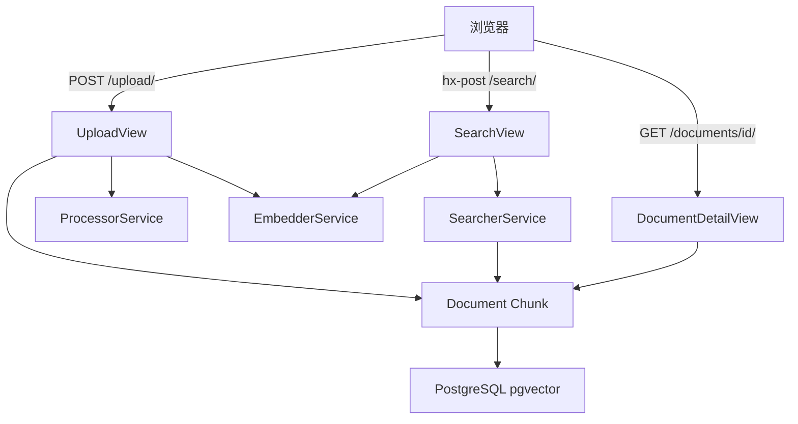
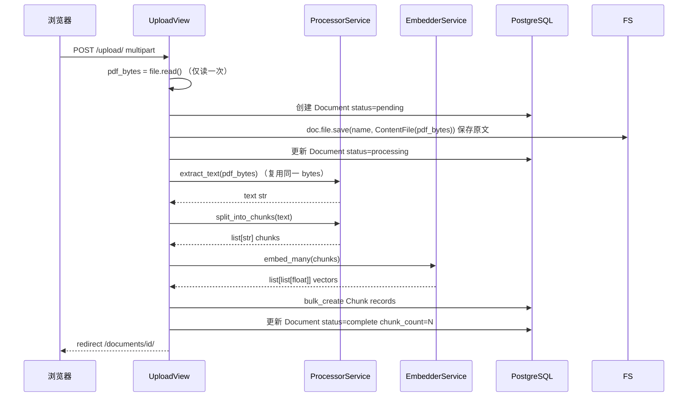
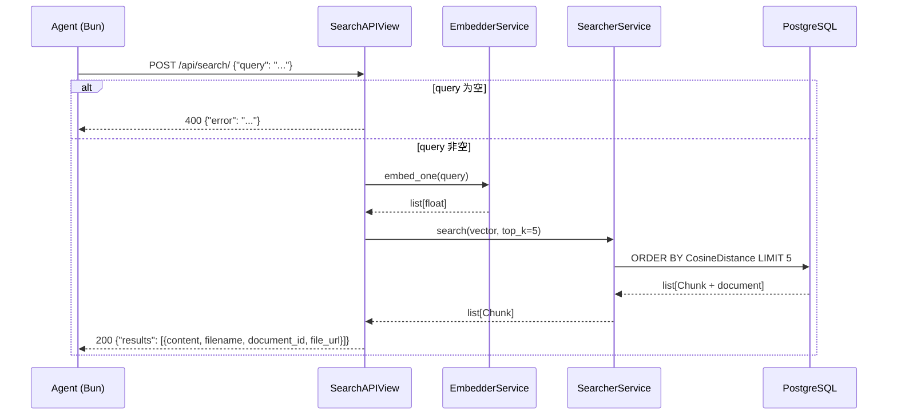
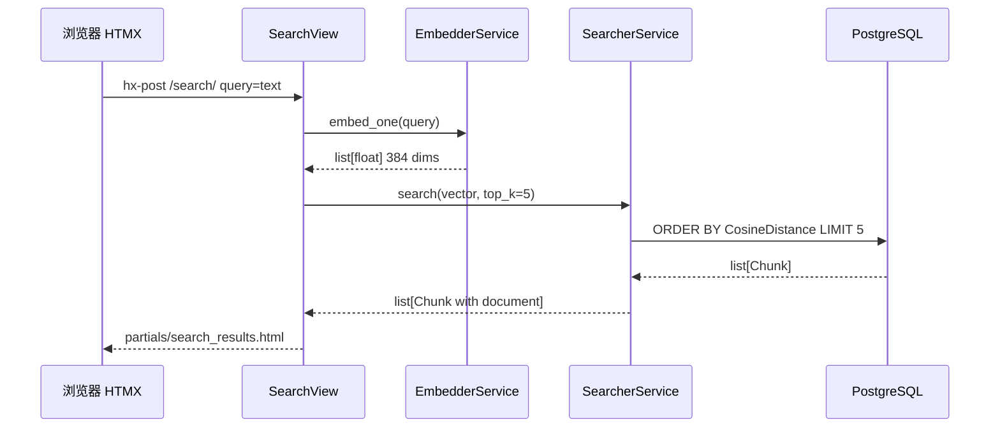

# 技术设计文档：pdf-knowledge-base

## 概述

本功能为学习 RAG 检索层基础知识的开发者构建一个本地 PDF 知识库系统。系统支持上传 PDF 文件，通过服务层 pipeline 完成文本提取、固定大小分块、嵌入向量生成并存储至向量数据库，最终通过自然语言查询执行语义搜索并返回最相关的文本块。

此外，系统对外暴露一组**只读 JSON API**（语义搜索 / 文档列表 / 文档详情），供外部编排层（typescript-agent）以程序方式调用既有检索能力；同时**持久化保存上传的原始 PDF 文件**，并在 HTML 页面与 JSON API 中提供整份文件的查看链接。

**用户**：学习 RAG 系统基础的开发者（直接使用页面）；外部编排层 Agent（通过 JSON API 调用）。  
**范围**：覆盖 RAG 系统的 Retrieval 部分及其程序化访问层，不涉及 LLM 生成（由 typescript-agent 承担）。

### 目标

- 提供完整的 PDF ingestion pipeline：上传 → 提取 → 分块 → 嵌入 → 存储
- 实现基于向量余弦相似度的语义搜索，返回前 5 个相关文本块
- 通过服务层架构使各 pipeline 步骤职责清晰，便于学习和 Phase 2 扩展
- 暴露只读 JSON API（搜索 / 列表 / 详情），复用既有 service 层，供 Agent 程序化调用
- 持久化保存原始 PDF 文件，并提供整份文件的查看链接（HTML 页面与 JSON 均可引用）

### 非目标

- LLM 回答生成（由 typescript-agent 承担）、Agent 编排循环、聊天界面
- 异步任务处理（Celery、RQ 等）
- 用户认证、多用户支持、API 鉴权
- 原文页级深链（跳转到来源具体页码——固定字符分块不记录页码，列为后续增强）
- 原始文件的对象存储 / 云存储与生产级 MEDIA 配信（首版仅本地文件系统，保存先后续再处理）
- API 的写操作（创建 / 更新 / 删除文档）
- 非 PDF 来源（URL、代码仓库）

---

## 边界承诺

### 本规格拥有

- PDF 上传接收与文件元数据存储
- 文本提取 → 固定大小分块 → 嵌入生成的完整 ingestion pipeline
- Document 与 Chunk 的向量数据存储
- **原始 PDF 文件的本地持久化（FileField + 本地文件系统）**
- 基于向量相似度的语义搜索（HTML 页面 + JSON API）
- **只读 JSON API：语义搜索 / 文档列表 / 文档详情**
- **整份原始文件的查看链接（绝对 URL），供 HTML 页面与 JSON API 共用**
- 三个页面的 UI：上传页 / 文档详情页 / 搜索页

### 边界之外

- LLM 或任何语言模型调用、Agent 编排循环（typescript-agent 拥有）
- 原始文件的对象存储 / 云存储与生产级 MEDIA 配信（首版仅本地文件系统）
- 原文页级深链（跳转到来源具体页码）
- 专用文件下载视图（`FileField.url` + dev MEDIA 配信已满足；专用 `FileResponse` 后续）
- API 鉴权、CORS 生产配置（Tool 调用为服务端到服务端，文件链接为浏览器直接导航，均不触发 CORS）
- API 写操作（创建 / 更新 / 删除）
- 异步后台任务（ingestion 为同步阻塞）
- 用户账户与权限系统
- ivfflat / HNSW 向量索引优化（数据量小的学习项目中可选）

### 允许的依赖

- PostgreSQL 15+ 与 pgvector 扩展
- `pgvector` Python 包（VectorField、CosineDistance）
- `PyMuPDF`（文本提取）
- `sentence-transformers`（本地嵌入推理）
- Django ORM（数据访问）
- **Django 内置 `FileField` / `FileSystemStorage` / `JsonResponse` / `View`（无新增 pip 依赖，不引入 DRF）**

### 重新验证触发条件

- 嵌入模型更换或向量维度变更 → 需重建所有 Chunk 嵌入
- `Chunk` 或 `Document` 模型结构变更 → 影响 Phase 2 LLM 集成接口
- 搜索相似度指标变更（余弦 → L2）→ 需更新 SearcherService 与任何已建索引
- **JSON API 响应契约（字段名 / 结构 / `file_url`）变更 → typescript-agent 的 Tool 实现需同步**
- **文件存储后端从本地 FileSystemStorage 迁移至对象存储 → 需重新设计配信与链接生成（`_file_url`）**

---

## 架构

### 架构模式：服务层（Service Layer）

单一 Django 应用 `knowledge_base`（项目配置位于 `config/`），视图层编排 pipeline，服务层封装 pipeline 各步骤，Django ORM 负责数据访问。  
依赖方向严格单向：**Views → Services → Models → Database**（服务层不导入视图，模型层不导入服务）。

服务层各模块直接对应学习目标：`processor.py` = 分块，`embedder.py` = 嵌入，`searcher.py` = 向量搜索。



### 技术栈

| 层 | 选择 / 版本 | 角色 |
|----|------------|------|
| 前端 | HTMX 2.x | 搜索结果无整页刷新局部更新 |
| 后端框架 | Django 4.2 LTS | Web 框架、ORM、模板渲染 |
| 向量数据库 | PostgreSQL 15 + pgvector 0.7+ | 嵌入向量存储与余弦相似度搜索 |
| PDF 提取 | PyMuPDF (pymupdf) latest | 从字节流提取文本 |
| 嵌入模型 | sentence-transformers + all-MiniLM-L6-v2 | 本地 384 维向量生成 |
| ORM 集成 | pgvector Python 包 | VectorField、CosineDistance、VectorExtension |

---

## 文件结构计划

> 说明：实际项目结构为 Django 项目 `config/`、应用 `knowledge_base/`（模板命名空间仍为 `kb/`）。下方以真实路径标注；🆕 = 新建，✏️ = 本次扩展修改，其余为既有不变。

```
manage.py
requirements.txt                     # 不变（FileField 为内置，无新增依赖）

config/                              # Django 项目配置
├── settings.py                      # ✏️ 新增 MEDIA_URL / MEDIA_ROOT
└── urls.py                          # ✏️ DEBUG 时挂载 static(MEDIA_URL, MEDIA_ROOT) 配信原文

media/                               # 🆕 原始 PDF 本地存储根（MEDIA_ROOT，运行时生成）
└── pdfs/                            #     FileField upload_to='pdfs/'

knowledge_base/                      # 主应用
├── migrations/
│   ├── 0001_vector_extension.py     # 既有
│   ├── 0002_initial.py              # 既有
│   └── 0003_document_file.py        # 🆕 Document.file 字段 AddField
├── services/
│   ├── processor.py                 # 既有不变
│   ├── embedder.py                  # 既有不变
│   └── searcher.py                  # 既有不变（已 select_related，搜索 API 直接复用）
├── templates/
│   └── kb/
│       ├── upload.html              # 既有不变
│       ├── document_detail.html     # ✏️ 增加"查看原文"链接（document.file 存在时）
│       ├── search.html              # 既有不变
│       └── partials/
│           └── search_results.html  # 既有不变
├── models.py                        # ✏️ Document 增加 file = FileField(upload_to='pdfs/')
├── views.py                         # ✏️ UploadView 保存原始文件（ContentFile）
├── api_views.py                     # 🆕 SearchAPIView / DocumentListAPIView / DocumentDetailAPIView
│                                    #     + 模块级序列化助手 _document_dict / _chunk_dict / _file_url
├── urls.py                          # ✏️ 注册 /api/search/、/api/documents/、/api/documents/<pk>/
└── forms.py                         # 既有不变（SearchForm 由 API 与 HTML 共用查询校验逻辑）
```

---

## 系统流程

### Ingestion Pipeline



> **文件读取顺序（解决 read-once 冲突）**：`pdf_bytes = file.read()` 只读一次，用 `ContentFile(pdf_bytes)` 保存原文，同一 `pdf_bytes` 再传给 `extract_text()`，无需 `seek(0)` 或重读。
> **原文保存时机**：在 ingestion 之前保存（status=processing 阶段）。因此即使后续提取/嵌入失败（如图像型 PDF），原始文件仍被保留，用户可在详情页通过链接查看原文。
> ingestion 整体包裹在 try-except 中。任意步骤异常时更新 `Document.status=failed` + `error_message`，仍 redirect 至详情页。

### JSON API（程序化访问）



> 文档列表（`GET /api/documents/`）与详情（`GET /api/documents/<pk>/`）直接经 ORM 取数后序列化为 JSON；详情对不存在的 pk 返回 `404 {"error": ...}`。所有 API 响应均为纯 JSON（无 HTML 包装）。
> 搜索 API 使用 `@csrf_exempt`（服务端到服务端调用，不依赖会话认证）。

### 语义搜索



---

## 需求可追溯性

| 需求 | 摘要 | 组件 | 接口 / 流程 |
|------|------|------|------------|
| 1.1 | 上传有效 PDF → 启动 ingestion | UploadView, ProcessorService, EmbedderService | POST /upload/ |
| 1.2 | ingestion 完成 → 重定向详情页 | UploadView | redirect /documents/{id}/ |
| 1.3 | 非 PDF 文件拒绝 | UploadForm | 400 + 表单校验错误 |
| 1.4 | 空文件拒绝 | UploadForm | 400 + 表单校验错误 |
| 2.1 | 提取所有页面文本 | ProcessorService.extract_text() | Ingestion Flow |
| 2.2 | 提取失败 → status=failed | ProcessorService, Document | Document.status |
| 2.3 | 文本与文档关联 | Chunk.document FK | 数据模型 |
| 3.1 | 固定大小分块 | ProcessorService.split_into_chunks() | Ingestion Flow |
| 3.2 | 块与文档关联存储 | Chunk model + bulk_create | 数据模型 |
| 3.3 | 详情页显示块总数 | DocumentDetailView, Document.chunk_count | GET /documents/{id}/ |
| 4.1 | 为每个块生成嵌入向量 | EmbedderService.embed_many() | Ingestion Flow |
| 4.2 | 内容 + 向量持久化 | Chunk.embedding VectorField(384) | 数据模型 |
| 4.3 | 嵌入失败 → status=failed | EmbedderService, Document | Document.status |
| 5.1 | 展示文件名/上传时间/块数/状态 | DocumentDetailView | GET /documents/{id}/ |
| 5.2 | 处理中状态展示 | Document.STATUS_PROCESSING | document_detail.html |
| 5.3 | 完成状态 + 块数展示 | Document.STATUS_COMPLETE | document_detail.html |
| 5.4 | 失败状态 + 原因展示 | Document.STATUS_FAILED + error_message | document_detail.html |
| 5.5 | 详情页提供查看原文链接 | DocumentDetailView, Document.file, document_detail.html | GET /documents/{id}/ |
| 6.1 | 非空查询 → 前 5 结果 | SearchView, SearcherService | POST /search/ |
| 6.2 | 按相似度降序排列 | SearcherService（CosineDistance 升序 = 相似度降序） | Search Flow |
| 6.3 | 无文档时展示提示 | SearchView 空结果处理 | search_results.html |
| 6.4 | 空查询阻止提交 | SearchForm.clean() | 表单校验 |
| 7.1 | 展示文本内容 + 文档名 | search_results.html, Chunk + Document | HTMX 局部模板 |
| 7.2 | 最多 5 个结果 | SearcherService top_k=5 | Search Flow |
| 7.3 | HTMX 无整页刷新 | SearchView + partials/search_results.html | hx-post + hx-target |
| 8.1 | 搜索 API 返回 ≤5 块（含 content/filename/file_url） | SearchAPIView, EmbedderService, SearcherService, _chunk_dict | POST /api/search/ |
| 8.2 | 按相似度降序 | SearcherService（CosineDistance 升序） | Search Flow |
| 8.3 | 纯 JSON 无 HTML 包装 | SearchAPIView → JsonResponse | POST /api/search/ |
| 8.4 | 空查询 → 400 + JSON 错误，不搜索 | SearchAPIView + SearchForm 校验 | 400 JSON |
| 8.5 | 无块时返回空列表非错误 | SearchAPIView（results=[]） | POST /api/search/ |
| 9.1 | 列表返回 id/filename/status/chunk_count/file_url | DocumentListAPIView, _document_dict | GET /api/documents/ |
| 9.2 | 无文档 → 空数组非错误 | DocumentListAPIView（documents=[]） | GET /api/documents/ |
| 9.3 | 纯 JSON 无 HTML 包装 | DocumentListAPIView → JsonResponse | GET /api/documents/ |
| 10.1 | 详情返回完整字段 + file_url | DocumentDetailAPIView, _document_dict | GET /api/documents/{pk}/ |
| 10.2 | 不存在 pk → 404 + JSON 错误 | DocumentDetailAPIView（get_object_or_404 → JSON） | 404 JSON |
| 10.3 | 纯 JSON 无 HTML 包装 | DocumentDetailAPIView → JsonResponse | GET /api/documents/{pk}/ |
| 11.1 | 上传成功 → 持久化原始 PDF | UploadView, Document.file（FileField） | Ingestion Flow |
| 11.2 | 通过链接请求 → 返回原文内容 | Document.file.url + dev MEDIA 配信 | GET {MEDIA_URL}/pdfs/... |
| 11.3 | 文档/文件不存在 → 未找到 | DocumentDetailAPIView 404 / MEDIA 404 | 404 |
| 11.4 | 提供稳定查看链接（HTML + JSON 共用） | _file_url（build_absolute_uri）, Document.file | file_url 字段 / 模板链接 |

---

## 组件与接口

### 组件总览

| 组件 | 层 | 职责 | 需求 | 关键依赖（P0/P1） |
|------|----|----|------|-----------------|
| Document | 数据模型 | 文档元数据 + 状态机 | 1.2, 2.2, 3.3, 4.3, 5.1-5.4 | pgvector (P0) |
| Chunk | 数据模型 | 文本块 + 嵌入向量 | 2.3, 3.2, 4.2, 7.1 | VectorField (P0) |
| ProcessorService | 服务层 | 文本提取 + 固定分块 | 2.1, 2.2, 3.1 | PyMuPDF (P0) |
| EmbedderService | 服务层 | 批量/单次嵌入生成 | 4.1, 4.3 | sentence-transformers (P0) |
| SearcherService | 服务层 | 向量相似度 top-k 搜索 | 6.1, 6.2, 7.2 | pgvector CosineDistance (P0) |
| UploadView | 视图层 | ingestion 编排 + 表单处理 | 1.1-1.4 | ProcessorService, EmbedderService (P0) |
| DocumentDetailView | 视图层 | 文档状态展示 | 5.1-5.4 | Document (P0) |
| SearchView | 视图层 | 搜索编排 + HTMX 检测 | 6.1-6.4, 7.1-7.3 | EmbedderService, SearcherService (P0) |
| UploadForm / SearchForm | 表单 | 输入校验 | 1.3, 1.4, 6.4, 8.4 | Django Forms (P0) |
| SearchAPIView | 视图层(API) | 搜索 JSON 端点编排 | 8.1-8.5 | EmbedderService, SearcherService, SearchForm (P0) |
| DocumentListAPIView | 视图层(API) | 文档列表 JSON | 9.1-9.3 | Document, _document_dict (P0) |
| DocumentDetailAPIView | 视图层(API) | 文档详情 JSON + 404 | 10.1-10.3, 11.3 | Document, _document_dict (P0) |
| 序列化助手 (_document_dict / _chunk_dict / _file_url) | 视图层(API) | ORM 对象 → dict + 绝对文件链接 | 8.1, 9.1, 10.1, 11.4 | Document.file, request (P0) |
| Document.file (FileField) | 数据模型 | 原始 PDF 本地持久化 | 11.1, 11.2, 11.4 | FileSystemStorage (P0) |

---

### 数据层

#### Document 模型

**契约**：Service [✓] / API [ ] / Event [ ] / Batch [ ] / State [✓]

```python
class Document(models.Model):
    STATUS_PENDING    = 'pending'
    STATUS_PROCESSING = 'processing'
    STATUS_COMPLETE   = 'complete'
    STATUS_FAILED     = 'failed'

    filename:      str       # CharField(max_length=255)
    file:          FieldFile # FileField(upload_to='pdfs/', blank=True, null=True) — 原始 PDF
    uploaded_at:   datetime  # DateTimeField(auto_now_add=True)
    status:        str       # CharField(choices=..., default=STATUS_PENDING)
    error_message: str       # TextField(blank=True, default='')
    chunk_count:   int       # IntegerField(default=0)
```

状态转换：`pending → processing → complete | failed`（单向，无逆转）  
`chunk_count`：ingestion bulk_create 完成后一次性写入，不实时 COUNT 查询。  
`error_message`：仅 status=failed 时非空。  
`file`：原始 PDF 存于本地文件系统（`MEDIA_ROOT/pdfs/`）。`blank=True, null=True` 兼容既有行与未存储情形；`file.url` 提供 MEDIA 相对路径，`_file_url()` 经 `build_absolute_uri` 转绝对 URL。新增字段经迁移 `0003_document_file.py` 应用。

#### Chunk 模型

```python
class Chunk(models.Model):
    document:  Document       # ForeignKey(Document, on_delete=CASCADE, related_name='chunks')
    content:   str            # TextField()
    embedding: list[float]    # VectorField(dimensions=384)
    position:  int            # IntegerField() — 从 0 开始的文档内序号
```

`embedding` 维度固定 384（all-MiniLM-L6-v2 输出）。Chunk 随 Document 删除（CASCADE）。

---

### 服务层

#### ProcessorService

**契约**：Service [✓]

```python
# knowledge_base/services/processor.py

def extract_text(pdf_bytes: bytes) -> str:
    """
    前置条件：pdf_bytes 为非空字节串
    后置条件：返回合并全文本；图像型 PDF 返回空字符串 ''
    异常：任何 pymupdf 异常向上抛出（由 UploadView 捕获）
    """

def split_into_chunks(text: str, chunk_size: int = 1000) -> list[str]:
    """
    前置条件：text 为字符串（可为空）
    后置条件：返回长度 ≤ chunk_size 的字符串列表；text 为空时返回 []
    不变式：所有块按顺序拼接等于 text（无字符丢失）
    """
```

**实现注意**：
- 分块按字符数切分，不保证句子完整性（学习项目可接受）
- `pymupdf.open(stream=pdf_bytes, filetype="pdf")`；捕获 `Exception`（v1.23+ 存在多种异常类型）

#### EmbedderService

**契约**：Service [✓]

```python
# knowledge_base/services/embedder.py

# 模块级单例 — 避免每次请求重新加载模型（约 90MB）
_model = SentenceTransformer("all-MiniLM-L6-v2")

def embed_many(texts: list[str]) -> list[list[float]]:
    """
    前置条件：texts 非空列表，每个元素为非空字符串
    后置条件：返回与 texts 等长的向量列表，每个向量 384 维 float
    """

def embed_one(text: str) -> list[float]:
    """
    前置条件：text 为非空字符串
    后置条件：返回 384 维 float 列表
    """
```

**实现注意**：
- `_model.encode(texts, normalize_embeddings=True)` 返回 numpy array，`.tolist()` 转换为 `list[list[float]]`
- `normalize_embeddings=True`：L2 归一化，与 CosineDistance 查询一致

#### SearcherService

**契约**：Service [✓]

```python
# knowledge_base/services/searcher.py

def search(query_vector: list[float], top_k: int = 5) -> list[Chunk]:
    """
    前置条件：query_vector 为 384 维向量，top_k > 0
    后置条件：按余弦相似度降序（CosineDistance 升序）返回 ≤ top_k 个 Chunk
              每个 Chunk 已 select_related('document')
              若 Chunk 表为空，返回 []
    """
    return (
        Chunk.objects
        .select_related('document')
        .order_by(CosineDistance('embedding', query_vector))[:top_k]
    )
```

**实现注意**：`CosineDistance` 值域 [0, 2]，0 = 完全相同；ascending 排序 = 最相似在前。

---

### 视图层

#### UploadView

**契约**：API [✓]

| Method | URL | 请求 | 响应 | 错误 |
|--------|-----|------|------|------|
| GET | /upload/ | — | upload.html | — |
| POST | /upload/ | multipart/form-data (pdf_file) | redirect /documents/{id}/ | 400 表单错误 |

**实现注意**：
- POST 流程：UploadForm 校验 → `pdf_bytes = file.read()`（仅一次）→ 创建 `Document(status=pending)` → `doc.file.save(file.name, ContentFile(pdf_bytes), save=False)` 保存原文 → `status=processing` 保存 → try ingestion（复用 `pdf_bytes`）→ 更新 status → redirect
- ingestion 整体在 `try-except Exception` 内；异常时写入 `error_message` + `status=failed`，仍 redirect 详情页
- **原文先于 ingestion 保存**：提取/嵌入失败时原始 PDF 仍保留，详情页链接可查看（需求 11.1）
- `ContentFile(pdf_bytes)` 复用已读字节作为存储源，避免对 upload 文件二次 `read()`（read-once 冲突）

#### DocumentDetailView

**契约**：API [✓]

| Method | URL | 响应 |
|--------|-----|------|
| GET | /documents/\<int:pk\>/ | document_detail.html |

`get_object_or_404(Document, pk=pk)`；模板根据 `document.status` 条件渲染状态块。  
**查看原文链接（需求 5.5）**：`document_detail.html` 在 `` 时渲染指向 `{{ document.file.url }}` 的链接（`target="_blank"`）；未存储原文时不显示。

#### SearchView

**契约**：API [✓]

| Method | URL | HX-Request 头 | 响应 |
|--------|-----|--------------|------|
| GET | /search/ | 无 | search.html（空结果区） |
| POST | /search/ | true | partials/search_results.html |
| POST | /search/ | 无 | search.html + results（降级） |

```python
is_htmx = request.headers.get("HX-Request") == "true"
template = "kb/partials/search_results.html" if is_htmx else "kb/search.html"
```

空查询由 `SearchForm.clean()` 校验，校验失败时返回表单错误（不调用 EmbedderService）。

---

### API 视图层（JSON）

> 全部位于 `knowledge_base/api_views.py`，使用 Django 内置 `View` + `JsonResponse`，不引入 DRF。所有响应 `Content-Type: application/json`，不含 HTML。

#### 序列化助手（模块级函数）

**契约**：Service [✓]

```python
# knowledge_base/api_views.py

def _file_url(doc: Document, request) -> str | None:
    """原始文件的绝对 URL；未存储时返回 None
    后置条件：doc.file 为真 → request.build_absolute_uri(doc.file.url)；否则 None
    """

def _document_dict(doc: Document, request) -> dict:
    """Document → JSON dict
    字段：id, filename, status, chunk_count, uploaded_at(ISO), error_message, file_url
    """

def _chunk_dict(chunk: Chunk, request) -> dict:
    """Chunk → JSON dict（依赖 chunk.document 已 select_related）
    字段：content, filename(=chunk.document.filename), document_id, file_url
    """
```

#### SearchAPIView

**契约**：API [✓]

| Method | URL | 请求体 | 成功响应 | 错误 |
|--------|-----|--------|---------|------|
| POST | /api/search/ | `application/json` `{"query": str}` | 200 `{"results": [_chunk_dict, ...]}`（≤5） | 400 `{"error": str}`（query 空/缺失） |

```python
@method_decorator(csrf_exempt, name='dispatch')
class SearchAPIView(View):
    def post(self, request):
        # JSON body 解析 → SearchForm 复用校验 query 非空
        # 校验失败 → JsonResponse({"error": ...}, status=400)，不调用服务
        # 校验通过 → embedder.embed_one → searcher.search(top_k=5)
        #          → JsonResponse({"results": [_chunk_dict(c, request) for c in chunks]})
        # Chunk 表为空 → results == [] （200，非错误，需求 8.5）
```

**实现注意**：
- **硬契约**：请求必须为 `Content-Type: application/json`，请求体为 `{"query": str}`。typescript-agent 的 Tool 必须以 JSON body 调用——form-encoded 或 query 参数不在契约内
- 请求体解析 `json.loads(request.body)`；非法 JSON 或缺 `query` → 视为空查询走 400 分支
- 复用 `SearchForm` 的 `clean_query` 保证与 HTML 搜索一致的空查询语义（需求 8.4）
- `csrf_exempt`：服务端到服务端调用，无会话认证

#### DocumentListAPIView

**契约**：API [✓]

| Method | URL | 响应 |
|--------|-----|------|
| GET | /api/documents/ | 200 `{"documents": [_document_dict, ...]}`（空库为 `[]`） |

```python
class DocumentListAPIView(View):
    def get(self, request):
        docs = Document.objects.all()  # Meta ordering: -uploaded_at
        return JsonResponse({"documents": [_document_dict(d, request) for d in docs]})
```

#### DocumentDetailAPIView

**契约**：API [✓]

| Method | URL | 成功响应 | 错误 |
|--------|-----|---------|------|
| GET | /api/documents/\<int:pk\>/ | 200 `_document_dict` | 404 `{"error": str}`（pk 不存在） |

```python
class DocumentDetailAPIView(View):
    def get(self, request, pk):
        try:
            doc = Document.objects.get(pk=pk)
        except Document.DoesNotExist:
            return JsonResponse({"error": "ドキュメントが見つかりません。"}, status=404)
        return JsonResponse(_document_dict(doc, request))
```

**JSON 契约（typescript-agent Tool 对齐基准）**：

```jsonc
// POST /api/search/ → 200
{ "results": [
  { "content": "…", "filename": "员工手册.pdf", "document_id": 3,
    "file_url": "http://host/media/pdfs/xxx.pdf" }
]}
// GET /api/documents/ → 200
{ "documents": [
  { "id": 1, "filename": "…", "status": "complete", "chunk_count": 12,
    "uploaded_at": "2026-06-18T…", "error_message": "", "file_url": "…" }
]}
// GET /api/documents/3/ → 200 同上单对象；不存在 → 404 {"error": "…"}
```

---

## 数据模型

### 领域模型

```
Document（聚合根）
  ├── status：状态机 pending → processing → complete | failed
  ├── chunk_count：ingestion 完成后写入
  └── Chunk[]（1-to-many，CASCADE）
        ├── content：原始文本块（≤1000 字符）
        ├── embedding：384 维归一化向量
        └── position：块在文档中的顺序（0-based）
```

### 物理数据模型

**Document 表**

| 字段 | 类型 | 约束 |
|------|------|------|
| id | SERIAL | PK |
| filename | VARCHAR(255) | NOT NULL |
| file | VARCHAR(100) | NULL（FileField，存相对路径如 `pdfs/xxx.pdf`） |
| uploaded_at | TIMESTAMPTZ | NOT NULL, auto |
| status | VARCHAR(20) | NOT NULL, DEFAULT 'pending' |
| error_message | TEXT | DEFAULT '' |
| chunk_count | INT | NOT NULL, DEFAULT 0 |

**Chunk 表**

| 字段 | 类型 | 约束 |
|------|------|------|
| id | SERIAL | PK |
| document_id | INT | FK Document(id) ON DELETE CASCADE |
| content | TEXT | NOT NULL |
| embedding | VECTOR(384) | NOT NULL |
| position | INT | NOT NULL |

**Migration 顺序**：`0001_vector_extension.py`（`VectorExtension()`）必须在 `0002_initial.py`（含 VectorField）之前运行。

---

## 错误处理

### 错误策略

| 错误场景 | 触发点 | 处理方式 | 用户反馈 |
|---------|--------|---------|---------|
| 非 PDF 文件 | UploadForm.clean() | 400 + 表单错误 | 上传页内联错误 |
| 空文件（0 字节） | UploadForm.clean() | 400 + 表单错误 | 上传页内联错误 |
| PDF 文本提取失败 | ProcessorService 抛异常 | Document.status=failed + error_message | 详情页"处理失败" |
| 嵌入生成失败 | EmbedderService 抛异常 | Document.status=failed + error_message | 详情页"处理失败" |
| 空查询 | SearchForm.clean() | 校验失败，不调用服务 | 搜索页内联提示 |
| 无可搜索文档 | SearcherService 返回 [] | 空列表渲染 | "暂无可搜索的文档" |
| API 空/非法查询 | SearchAPIView + SearchForm | 400 + JSON 错误，不调用服务 | `{"error": ...}` |
| API 文档不存在 | DocumentDetailAPIView | 404 + JSON 错误 | `{"error": "ドキュメントが見つかりません。"}` |
| API 无文档/无块 | List / Search API | 200 + 空数组（非错误） | `{"documents": []}` / `{"results": []}` |
| 原文未存储 | _file_url（doc.file 为空） | 返回 `file_url: null`，不报错 | JSON 中 `null`；详情页不显示链接 |

### 日志

`logger = logging.getLogger('knowledge_base')` 在各 service 模块中使用；ingestion 各步骤完成时记录 INFO，异常时记录 ERROR（含 traceback）。

---

## 测试策略

### 单元测试

1. `split_into_chunks('')` → 返回 `[]`；长度整好 1000 的文本 → 返回 1 个块；长度 1500 → 返回 2 个块
2. `split_into_chunks` 块顺序拼接等于原文本（不丢字符）
3. `EmbedderService.embed_one()` 输出维度为 384，类型为 `list[float]`
4. `EmbedderService.embed_many(['a', 'b', 'c'])` 输出长度为 3
5. `SearcherService.search()` 返回结果数 ≤ top_k，且已 select_related('document')

### 集成测试

1. 完整 ingestion — 上传真实 PDF fixture → `Document.status == 'complete'` + `Chunk.objects.filter(document=doc).count() > 0`
2. 图像型 PDF — 上传纯图像 PDF → `Document.status == 'failed'` + `error_message` 非空
3. 语义搜索 — ingestion 含特定关键词的 PDF，再搜该关键词 → 返回 ≤ 5 个 Chunk，相关块排在前
4. UploadView POST 完整流程 — Django test client 上传 PDF → 响应 302 + Location 含 `/documents/`
5. HTMX 搜索请求 — POST `/search/` 含 `HTTP_HX_REQUEST=true` → 响应不含 `<html>` 标签
6. **原文持久化（需求 11.1）** — 上传 PDF → `doc.file` 非空且 `doc.file.read()` 等于上传字节；上传图像型 PDF（ingestion 失败）→ `status=='failed'` 但 `doc.file` 仍非空
7. **详情页查看链接（需求 5.5）** — 已存原文文档的详情页 HTML 含指向 `doc.file.url` 的链接

### API 测试（需求 8/9/10/11）

1. **搜索 API 正常** — ingestion 含关键词 PDF 后 `POST /api/search/ {"query": kw}` → 200，`results` ≤5 且每项含 `content`/`filename`/`file_url`，`file_url` 为绝对 URL
2. **搜索 API 空查询** — `POST /api/search/ {"query": ""}`（及缺 `query`）→ 400 + `error`，且不调用 Embedder/Searcher
3. **搜索 API 空库** — 空数据库 `POST /api/search/` 非空查询 → 200 `{"results": []}`
4. **搜索 API 纯 JSON** — 响应体不含 `<html>`，`Content-Type` 为 `application/json`
5. **列表 API** — 有/无文档分别返回 `{"documents": [...]}` / `{"documents": []}`，每项含 `file_url`
6. **详情 API 正常** — 有效 pk → 200，含全部字段 + `file_url`
7. **详情 API 404** — 不存在 pk → 404 + `{"error": ...}`（JSON）
8. **file_url 空值** — `doc.file` 为空的文档 → JSON `file_url == null`，不报错

### E2E 关键路径

1. 上传有效 PDF → redirect → 详情页 status="处理完成" + chunk_count > 0 + 可见"查看原文"链接
2. 上传非 PDF 文件 → 停留上传页 + 表单错误消息可见
3. 语义搜索 → 结果区无整页刷新更新（验证 `HX-Request` 头） → ≤ 5 条结果各含文档名
4. Agent 视角链路 — `POST /api/search/` 取得结果 → 跟随 `file_url` GET → 返回原始 PDF 内容（dev MEDIA 配信）
