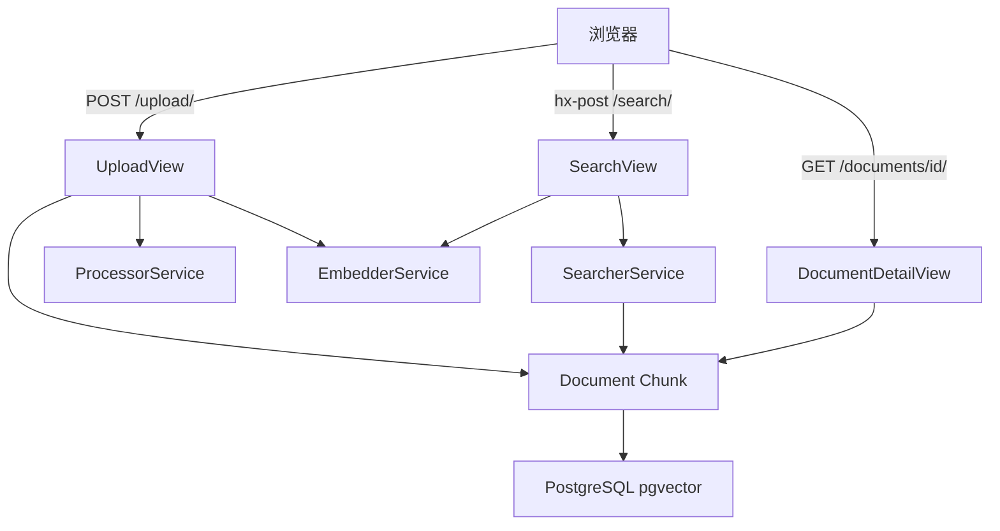
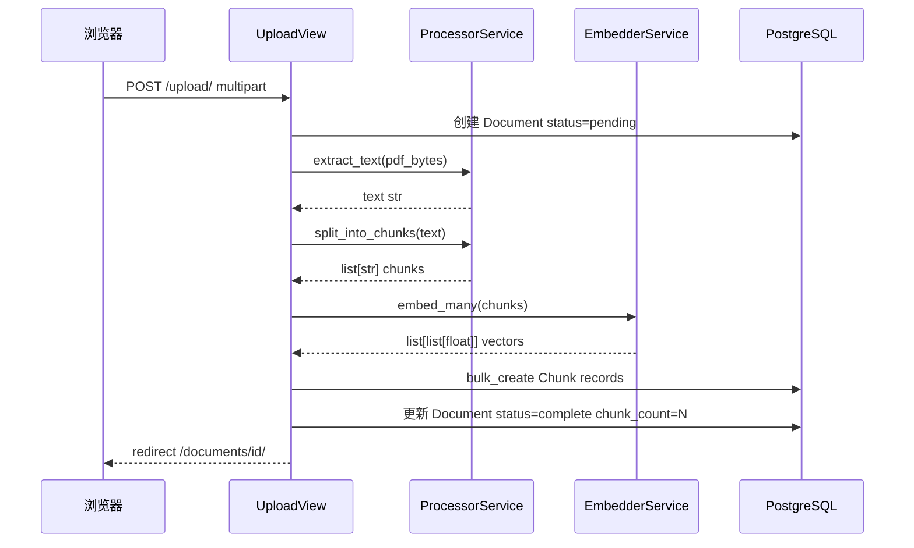
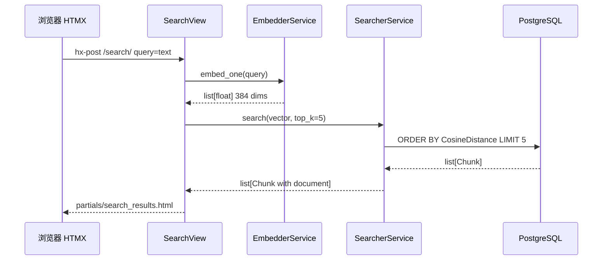

# 技术设计文档：pdf-knowledge-base

## 概述

本功能为学习 RAG 检索层基础知识的开发者构建一个本地 PDF 知识库系统。系统支持上传 PDF 文件，通过服务层 pipeline 完成文本提取、固定大小分块、嵌入向量生成并存储至向量数据库，最终通过自然语言查询执行语义搜索并返回最相关的文本块。

**用户**：学习 RAG 系统基础的开发者，通过此项目体验分块、嵌入、向量搜索的完整流程。  
**范围**：覆盖 RAG 系统的 Retrieval 部分，不涉及 LLM 生成。

### 目标

- 提供完整的 PDF ingestion pipeline：上传 → 提取 → 分块 → 嵌入 → 存储
- 实现基于向量余弦相似度的语义搜索，返回前 5 个相关文本块
- 通过服务层架构使各 pipeline 步骤职责清晰，便于学习和 Phase 2 扩展

### 非目标

- LLM 回答生成（Phase 2 计划）
- 异步任务处理（Celery、RQ 等）
- 用户认证、多用户支持
- PDF 文件持久化存储（处理完成后不保留原始文件）
- 非 PDF 来源（URL、代码仓库）

---

## 边界承诺

### 本规格拥有

- PDF 上传接收与文件元数据存储
- 文本提取 → 固定大小分块 → 嵌入生成的完整 ingestion pipeline
- Document 与 Chunk 的向量数据存储
- 基于向量相似度的语义搜索 API
- 三个页面的 UI：上传页 / 文档详情页 / 搜索页

### 边界之外

- LLM 或任何语言模型调用
- 原始 PDF 文件的磁盘持久化存储
- 异步后台任务（ingestion 为同步阻塞）
- 用户账户与权限系统
- ivfflat / HNSW 向量索引优化（数据量小的学习项目中可选）

### 允许的依赖

- PostgreSQL 15+ 与 pgvector 扩展
- `pgvector` Python 包（VectorField、CosineDistance）
- `PyMuPDF`（文本提取）
- `sentence-transformers`（本地嵌入推理）
- Django ORM（数据访问）

### 重新验证触发条件

- 嵌入模型更换或向量维度变更 → 需重建所有 Chunk 嵌入
- `Chunk` 或 `Document` 模型结构变更 → 影响 Phase 2 LLM 集成接口
- 搜索相似度指标变更（余弦 → L2）→ 需更新 SearcherService 与任何已建索引

---

## 架构

### 架构模式：服务层（Service Layer）

单一 Django 应用 `kb`，视图层编排 pipeline，服务层封装 pipeline 各步骤，Django ORM 负责数据访问。  
依赖方向严格单向：**Views → Services → Models → Database**（服务层不导入视图，模型层不导入服务）。

服务层各模块直接对应学习目标：`processor.py` = 分块，`embedder.py` = 嵌入，`searcher.py` = 向量搜索。



### 技术栈

| 层 | 选择 / 版本 | 角色 |
|----|------------|------|
| 前端 | HTMX 2.x | 搜索结果无整页刷新局部更新 |
| 后端框架 | Django 4.2 LTS | Web 框架、ORM、模板渲染 |
| 向量数据库 | PostgreSQL 15 + pgvector 0.7+ | 嵌入向量存储与余弦相似度搜索 |
| PDF 提取 | PyMuPDF (pymupdf) latest | 从字节流提取文本 |
| 嵌入模型 | sentence-transformers + all-MiniLM-L6-v2 | 本地 384 维向量生成 |
| ORM 集成 | pgvector Python 包 | VectorField、CosineDistance、VectorExtension |

---

## 文件结构计划

```
manage.py
requirements.txt

rag_agent/                        # Django 项目配置
├── settings.py
└── urls.py

kb/                               # 主应用
├── migrations/
│   ├── 0001_vector_extension.py  # VectorExtension() 操作（必须在 VectorField 之前）
│   └── 0002_initial.py           # Document、Chunk 表
├── services/
│   ├── __init__.py
│   ├── processor.py              # 文本提取（PyMuPDF）+ 固定大小分块
│   ├── embedder.py               # 嵌入向量生成（all-MiniLM-L6-v2 单例）
│   └── searcher.py               # pgvector 余弦相似度 top-k 搜索
├── templates/
│   └── kb/
│       ├── upload.html
│       ├── document_detail.html
│       ├── search.html
│       └── partials/
│           └── search_results.html  # HTMX 局部模板（仅结果列表）
├── models.py                     # Document、Chunk 模型
├── views.py                      # UploadView、DocumentDetailView、SearchView
├── urls.py
└── forms.py                      # UploadForm、SearchForm
```

---

## 系统流程

### Ingestion Pipeline



> ingestion 整体包裹在 try-except 中。任意步骤异常时更新 `Document.status=failed` + `error_message`，仍 redirect 至详情页。

### 语义搜索



---

## 需求可追溯性

| 需求 | 摘要 | 组件 | 接口 / 流程 |
|------|------|------|------------|
| 1.1 | 上传有效 PDF → 启动 ingestion | UploadView, ProcessorService, EmbedderService | POST /upload/ |
| 1.2 | ingestion 完成 → 重定向详情页 | UploadView | redirect /documents/{id}/ |
| 1.3 | 非 PDF 文件拒绝 | UploadForm | 400 + 表单校验错误 |
| 1.4 | 空文件拒绝 | UploadForm | 400 + 表单校验错误 |
| 2.1 | 提取所有页面文本 | ProcessorService.extract_text() | Ingestion Flow |
| 2.2 | 提取失败 → status=failed | ProcessorService, Document | Document.status |
| 2.3 | 文本与文档关联 | Chunk.document FK | 数据模型 |
| 3.1 | 固定大小分块 | ProcessorService.split_into_chunks() | Ingestion Flow |
| 3.2 | 块与文档关联存储 | Chunk model + bulk_create | 数据模型 |
| 3.3 | 详情页显示块总数 | DocumentDetailView, Document.chunk_count | GET /documents/{id}/ |
| 4.1 | 为每个块生成嵌入向量 | EmbedderService.embed_many() | Ingestion Flow |
| 4.2 | 内容 + 向量持久化 | Chunk.embedding VectorField(384) | 数据模型 |
| 4.3 | 嵌入失败 → status=failed | EmbedderService, Document | Document.status |
| 5.1 | 展示文件名/上传时间/块数/状态 | DocumentDetailView | GET /documents/{id}/ |
| 5.2 | 处理中状态展示 | Document.STATUS_PROCESSING | document_detail.html |
| 5.3 | 完成状态 + 块数展示 | Document.STATUS_COMPLETE | document_detail.html |
| 5.4 | 失败状态 + 原因展示 | Document.STATUS_FAILED + error_message | document_detail.html |
| 6.1 | 非空查询 → 前 5 结果 | SearchView, SearcherService | POST /search/ |
| 6.2 | 按相似度降序排列 | SearcherService（CosineDistance 升序 = 相似度降序） | Search Flow |
| 6.3 | 无文档时展示提示 | SearchView 空结果处理 | search_results.html |
| 6.4 | 空查询阻止提交 | SearchForm.clean() | 表单校验 |
| 7.1 | 展示文本内容 + 文档名 | search_results.html, Chunk + Document | HTMX 局部模板 |
| 7.2 | 最多 5 个结果 | SearcherService top_k=5 | Search Flow |
| 7.3 | HTMX 无整页刷新 | SearchView + partials/search_results.html | hx-post + hx-target |

---

## 组件与接口

### 组件总览

| 组件 | 层 | 职责 | 需求 | 关键依赖（P0/P1） |
|------|----|----|------|-----------------|
| Document | 数据模型 | 文档元数据 + 状态机 | 1.2, 2.2, 3.3, 4.3, 5.1-5.4 | pgvector (P0) |
| Chunk | 数据模型 | 文本块 + 嵌入向量 | 2.3, 3.2, 4.2, 7.1 | VectorField (P0) |
| ProcessorService | 服务层 | 文本提取 + 固定分块 | 2.1, 2.2, 3.1 | PyMuPDF (P0) |
| EmbedderService | 服务层 | 批量/单次嵌入生成 | 4.1, 4.3 | sentence-transformers (P0) |
| SearcherService | 服务层 | 向量相似度 top-k 搜索 | 6.1, 6.2, 7.2 | pgvector CosineDistance (P0) |
| UploadView | 视图层 | ingestion 编排 + 表单处理 | 1.1-1.4 | ProcessorService, EmbedderService (P0) |
| DocumentDetailView | 视图层 | 文档状态展示 | 5.1-5.4 | Document (P0) |
| SearchView | 视图层 | 搜索编排 + HTMX 检测 | 6.1-6.4, 7.1-7.3 | EmbedderService, SearcherService (P0) |
| UploadForm / SearchForm | 表单 | 输入校验 | 1.3, 1.4, 6.4 | Django Forms (P0) |

---

### 数据层

#### Document 模型

**契约**：Service [✓] / API [ ] / Event [ ] / Batch [ ] / State [✓]

```python
class Document(models.Model):
    STATUS_PENDING    = 'pending'
    STATUS_PROCESSING = 'processing'
    STATUS_COMPLETE   = 'complete'
    STATUS_FAILED     = 'failed'

    filename:      str       # CharField(max_length=255)
    uploaded_at:   datetime  # DateTimeField(auto_now_add=True)
    status:        str       # CharField(choices=..., default=STATUS_PENDING)
    error_message: str       # TextField(blank=True, default='')
    chunk_count:   int       # IntegerField(default=0)
```

状态转换：`pending → processing → complete | failed`（单向，无逆转）  
`chunk_count`：ingestion bulk_create 完成后一次性写入，不实时 COUNT 查询。  
`error_message`：仅 status=failed 时非空。

#### Chunk 模型

```python
class Chunk(models.Model):
    document:  Document       # ForeignKey(Document, on_delete=CASCADE, related_name='chunks')
    content:   str            # TextField()
    embedding: list[float]    # VectorField(dimensions=384)
    position:  int            # IntegerField() — 从 0 开始的文档内序号
```

`embedding` 维度固定 384（all-MiniLM-L6-v2 输出）。Chunk 随 Document 删除（CASCADE）。

---

### 服务层

#### ProcessorService

**契约**：Service [✓]

```python
# kb/services/processor.py

def extract_text(pdf_bytes: bytes) -> str:
    """
    前置条件：pdf_bytes 为非空字节串
    后置条件：返回合并全文本；图像型 PDF 返回空字符串 ''
    异常：任何 pymupdf 异常向上抛出（由 UploadView 捕获）
    """

def split_into_chunks(text: str, chunk_size: int = 1000) -> list[str]:
    """
    前置条件：text 为字符串（可为空）
    后置条件：返回长度 ≤ chunk_size 的字符串列表；text 为空时返回 []
    不变式：所有块按顺序拼接等于 text（无字符丢失）
    """
```

**实现注意**：
- 分块按字符数切分，不保证句子完整性（学习项目可接受）
- `pymupdf.open(stream=pdf_bytes, filetype="pdf")`；捕获 `Exception`（v1.23+ 存在多种异常类型）

#### EmbedderService

**契约**：Service [✓]

```python
# kb/services/embedder.py

# 模块级单例 — 避免每次请求重新加载模型（约 90MB）
_model = SentenceTransformer("all-MiniLM-L6-v2")

def embed_many(texts: list[str]) -> list[list[float]]:
    """
    前置条件：texts 非空列表，每个元素为非空字符串
    后置条件：返回与 texts 等长的向量列表，每个向量 384 维 float
    """

def embed_one(text: str) -> list[float]:
    """
    前置条件：text 为非空字符串
    后置条件：返回 384 维 float 列表
    """
```

**实现注意**：
- `_model.encode(texts, normalize_embeddings=True)` 返回 numpy array，`.tolist()` 转换为 `list[list[float]]`
- `normalize_embeddings=True`：L2 归一化，与 CosineDistance 查询一致

#### SearcherService

**契约**：Service [✓]

```python
# kb/services/searcher.py

def search(query_vector: list[float], top_k: int = 5) -> list[Chunk]:
    """
    前置条件：query_vector 为 384 维向量，top_k > 0
    后置条件：按余弦相似度降序（CosineDistance 升序）返回 ≤ top_k 个 Chunk
              每个 Chunk 已 select_related('document')
              若 Chunk 表为空，返回 []
    """
    return (
        Chunk.objects
        .select_related('document')
        .order_by(CosineDistance('embedding', query_vector))[:top_k]
    )
```

**实现注意**：`CosineDistance` 值域 [0, 2]，0 = 完全相同；ascending 排序 = 最相似在前。

---

### 视图层

#### UploadView

**契约**：API [✓]

| Method | URL | 请求 | 响应 | 错误 |
|--------|-----|------|------|------|
| GET | /upload/ | — | upload.html | — |
| POST | /upload/ | multipart/form-data (pdf_file) | redirect /documents/{id}/ | 400 表单错误 |

**实现注意**：
- POST 流程：UploadForm 校验 → 创建 `Document(status=pending)` → try ingestion → 更新 status → redirect
- ingestion 整体在 `try-except Exception` 内；异常时写入 `error_message` + `status=failed`，仍 redirect 详情页
- PDF 内容 `request.FILES['pdf_file'].read()` 读为 bytes，不写入磁盘

#### DocumentDetailView

**契约**：API [✓]

| Method | URL | 响应 |
|--------|-----|------|
| GET | /documents/\<int:pk\>/ | document_detail.html |

`get_object_or_404(Document, pk=pk)`；模板根据 `document.status` 条件渲染状态块。

#### SearchView

**契约**：API [✓]

| Method | URL | HX-Request 头 | 响应 |
|--------|-----|--------------|------|
| GET | /search/ | 无 | search.html（空结果区） |
| POST | /search/ | true | partials/search_results.html |
| POST | /search/ | 无 | search.html + results（降级） |

```python
is_htmx = request.headers.get("HX-Request") == "true"
template = "kb/partials/search_results.html" if is_htmx else "kb/search.html"
```

空查询由 `SearchForm.clean()` 校验，校验失败时返回表单错误（不调用 EmbedderService）。

---

## 数据模型

### 领域模型

```
Document（聚合根）
  ├── status：状态机 pending → processing → complete | failed
  ├── chunk_count：ingestion 完成后写入
  └── Chunk[]（1-to-many，CASCADE）
        ├── content：原始文本块（≤1000 字符）
        ├── embedding：384 维归一化向量
        └── position：块在文档中的顺序（0-based）
```

### 物理数据模型

**Document 表**

| 字段 | 类型 | 约束 |
|------|------|------|
| id | SERIAL | PK |
| filename | VARCHAR(255) | NOT NULL |
| uploaded_at | TIMESTAMPTZ | NOT NULL, auto |
| status | VARCHAR(20) | NOT NULL, DEFAULT 'pending' |
| error_message | TEXT | DEFAULT '' |
| chunk_count | INT | NOT NULL, DEFAULT 0 |

**Chunk 表**

| 字段 | 类型 | 约束 |
|------|------|------|
| id | SERIAL | PK |
| document_id | INT | FK Document(id) ON DELETE CASCADE |
| content | TEXT | NOT NULL |
| embedding | VECTOR(384) | NOT NULL |
| position | INT | NOT NULL |

**Migration 顺序**：`0001_vector_extension.py`（`VectorExtension()`）必须在 `0002_initial.py`（含 VectorField）之前运行。

---

## 错误处理

### 错误策略

| 错误场景 | 触发点 | 处理方式 | 用户反馈 |
|---------|--------|---------|---------|
| 非 PDF 文件 | UploadForm.clean() | 400 + 表单错误 | 上传页内联错误 |
| 空文件（0 字节） | UploadForm.clean() | 400 + 表单错误 | 上传页内联错误 |
| PDF 文本提取失败 | ProcessorService 抛异常 | Document.status=failed + error_message | 详情页"处理失败" |
| 嵌入生成失败 | EmbedderService 抛异常 | Document.status=failed + error_message | 详情页"处理失败" |
| 空查询 | SearchForm.clean() | 校验失败，不调用服务 | 搜索页内联提示 |
| 无可搜索文档 | SearcherService 返回 [] | 空列表渲染 | "暂无可搜索的文档" |

### 日志

`logger = logging.getLogger('kb')` 在各 service 模块中使用；ingestion 各步骤完成时记录 INFO，异常时记录 ERROR（含 traceback）。

---

## 测试策略

### 单元测试

1. `split_into_chunks('')` → 返回 `[]`；长度整好 1000 的文本 → 返回 1 个块；长度 1500 → 返回 2 个块
2. `split_into_chunks` 块顺序拼接等于原文本（不丢字符）
3. `EmbedderService.embed_one()` 输出维度为 384，类型为 `list[float]`
4. `EmbedderService.embed_many(['a', 'b', 'c'])` 输出长度为 3
5. `SearcherService.search()` 返回结果数 ≤ top_k，且已 select_related('document')

### 集成测试

1. 完整 ingestion — 上传真实 PDF fixture → `Document.status == 'complete'` + `Chunk.objects.filter(document=doc).count() > 0`
2. 图像型 PDF — 上传纯图像 PDF → `Document.status == 'failed'` + `error_message` 非空
3. 语义搜索 — ingestion 含特定关键词的 PDF，再搜该关键词 → 返回 ≤ 5 个 Chunk，相关块排在前
4. UploadView POST 完整流程 — Django test client 上传 PDF → 响应 302 + Location 含 `/documents/`
5. HTMX 搜索请求 — POST `/search/` 含 `HTTP_HX_REQUEST=true` → 响应不含 `<html>` 标签

### E2E 关键路径

1. 上传有效 PDF → redirect → 详情页 status="处理完成" + chunk_count > 0
2. 上传非 PDF 文件 → 停留上传页 + 表单错误消息可见
3. 语义搜索 → 结果区无整页刷新更新（验证 `HX-Request` 头） → ≤ 5 条结果各含文档名
