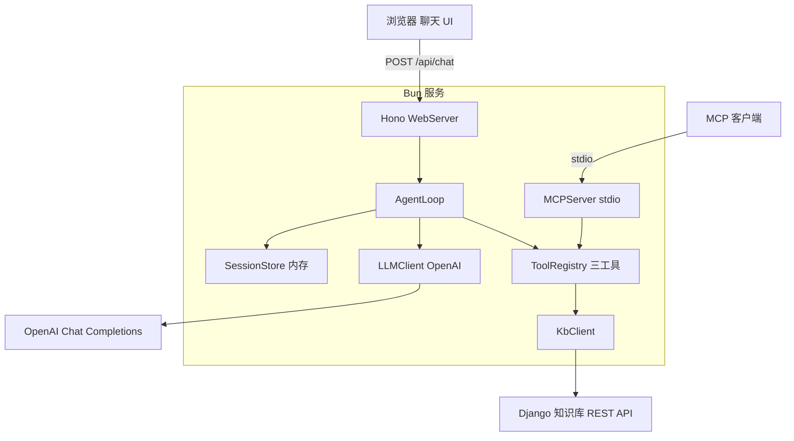
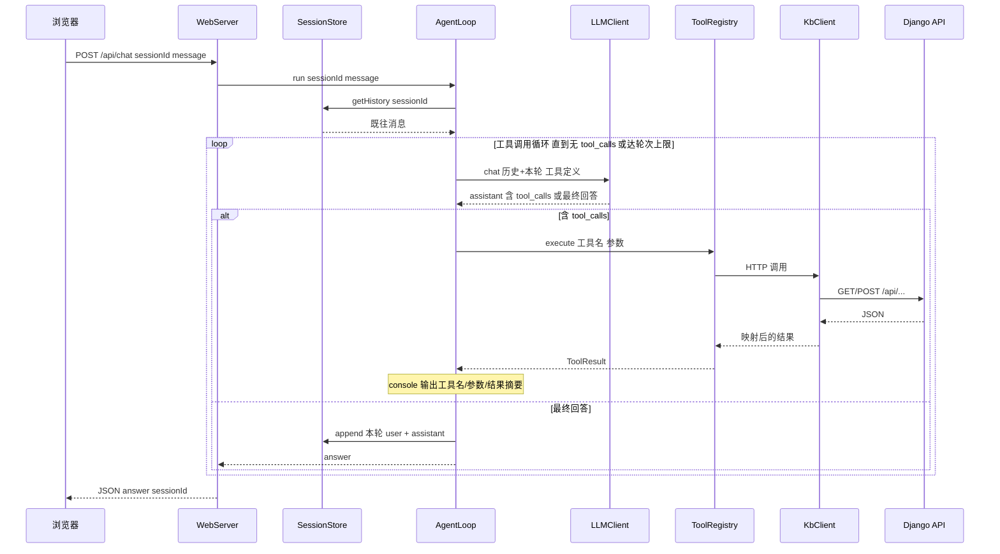
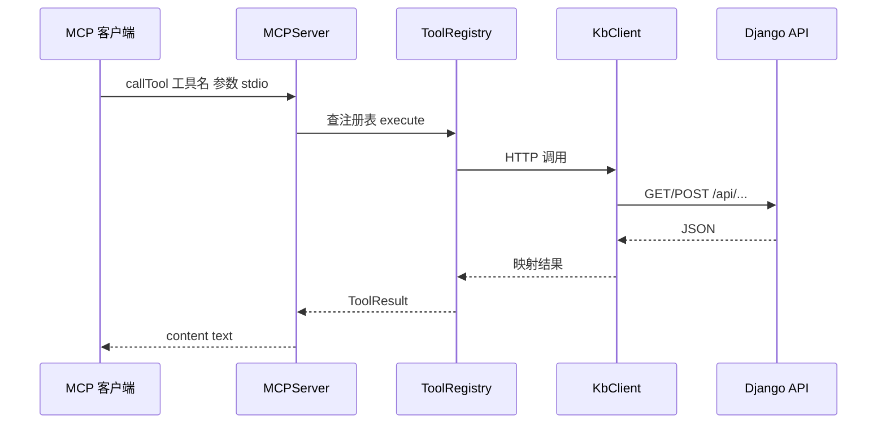

# 技术设计文档：typescript-agent

## 概述

本功能构建一个 TypeScript（Bun + Hono）的 AI Agent 服务，作为既有 PDF 知识库（Django + pgvector）的自然语言交互层。企业内部员工在网页聊天界面用自然语言提问，Agent 通过 LLM 的 Function Calling 自主判断并调用知识库工具，循环执行后彙整出带来源（文件名 + 片段 + 原文链接）的回答。同一套工具逻辑同时以 MCP Server 暴露，供其他 MCP 客户端复用。

**用户**：企业内部员工（非工程师，经 Web 聊天界面）；MCP 客户端（如其他 AI 助手，经 MCP 协议）。
**影响**：在既有知识库之上新增对话编排层；检索能力仍由既有 Django REST API 提供，本服务为其消费方。

### 目标

- 自行实现 Agent Loop（LLM Function Calling 循环，非框架黑盒）
- 三个知识库工具（语义搜索 / 文档列表 / 文档详情）单一定义、双端（Agent + MCP）复用
- 会话内多轮对话（内存内）
- 纯 HTML 聊天 UI（无前端 build）+ 思考过程 console 日志
- 带来源与原文链接的回答；空结果不编造

### 非目标

- 嵌入与向量搜索（保留在既有 Python 侧）
- 知识库 REST API 的实现（由 `pdf-knowledge-base` 提供）
- PDF 上传 / ingestion、用户认证、对话历史持久化、原文页级深链

---

## 边界承诺

### 本规格拥有

- Agent Loop（LLM Function Calling 编排、工具调用轮次上限）
- 三个工具的定义与执行逻辑（封装对 Django REST API 的 HTTP 调用）
- 会话内对话历史（内存内、会话隔离）
- Hono Web Server：静态 HTML 聊天页 + `POST /api/chat` 端点
- MCP Server（stdio，暴露同一套工具）
- 思考过程 console 日志
- LLM 客户端封装（OpenAI 兼容 Chat Completions）

### 边界之外

- Django 知识库 REST API 的实现、嵌入、向量搜索、PDF ingestion（`pdf-knowledge-base` 拥有）
- 用户认证与权限
- 对话历史持久化（仅内存内，重启即失）
- 原文页级深链、回答的流式输出（首版非流式，见 Open Questions）

### 允许的依赖

- 既有知识库 REST API 契约：`POST /api/search/`、`GET /api/documents/`、`GET /api/documents/<id>/`（含 `file_url` 字段）
- `openai` npm 包（Chat Completions API）
- `hono` + `hono/bun`（Web 框架与静态配信）
- `@modelcontextprotocol/sdk`（MCP Server，stdio transport）
- `zod`（工具参数 schema，Agent 与 MCP 共享）
- Bun runtime

### 重新验证触发条件

- 知识库 REST API 契约（端点、字段结构、`file_url`）变更 → 须同步 KbClient 与工具映射
- LLM 供应商 / model / baseURL 变更 → 须复核 LLMClient 与工具 schema 兼容性
- MCP transport 由 stdio 改为 HTTP → 须复测 Bun 启动延迟与连接方式
- 工具定义（名称 / 参数 / 返回结构）变更 → 同时影响 Agent 适配器与 MCP 适配器

---

## 架构

### 架构模式：分层 + 单一工具定义源

单一 Bun 进程。Web 层接收聊天请求，编排层（Agent Loop）驱动 LLM 与工具的往返循环，工具层是**单一定义源**，被 Agent 适配器与 MCP 适配器共同消费，工具内部经 KbClient 调用 Django REST API。

依赖方向严格单向：**Config / Types → KbClient → ToolRegistry → AgentLoop → WebServer**；`LLMClient` 供 AgentLoop 使用；`SessionStore` 供 AgentLoop 使用；`MCPServer` 直接消费 `ToolRegistry`（不经 AgentLoop）。各层只向左依赖，不向上。



### 技术栈

| 层 | 选择 / 版本 | 角色 | 备注 |
|----|------------|------|------|
| Runtime | Bun 1.3.x | 进程运行时 | 启动快、无 build；环境变量走 `process.env` |
| Web 框架 | Hono 4.12.x + `hono/bun` | 静态 HTML 配信 + `POST /api/chat` | `serveStatic` 提供 `public/` |
| LLM SDK | `openai` 6.x | Function Calling（Chat Completions API） | **不使用 Responses API** |
| LLM 供应商 | **OpenAI**（已确认） | 工具调用与回答生成 | model 经 `OPENAI_MODEL` 配置（如 `gpt-4o-mini`）；需自备付费 API key（无免信用卡免费层） |
| MCP | `@modelcontextprotocol/sdk` 1.29.x | MCP Server（stdio transport） | 与 Agent 复用同一工具注册表 |
| 工具 schema | `zod` | 工具参数定义（Agent + MCP 共享） | 经 zod 生成 OpenAI JSON Schema 与 MCP inputSchema |

---

## 文件结构计划

> 新建 TypeScript 项目，位于 repo 根的 `agent/` 目录（与 `knowledge_base/` Django 项目并列）。🆕 = 新建。

```
agent/                          # 🆕 全新 Bun + TypeScript 项目
├── package.json                # 依赖与脚本（bun run dev / test）
├── tsconfig.json               # strict 模式，禁用 any
├── .env.example                # OPENAI_API_KEY / OPENAI_MODEL / OPENAI_BASE_URL? / KB_API_BASE_URL
├── public/
│   └── index.html              # 纯 HTML 聊天 UI（无 build；fetch POST /api/chat）
└── src/
    ├── index.ts                # 入口：Hono server，挂 serveStatic + POST /api/chat
    ├── config.ts               # 环境变量加载与校验（启动时校验必填项）
    ├── types.ts                # 共享类型：ChatMessage / ToolCall / KB DTO 等
    ├── llm.ts                  # LLMClient：openai SDK 薄封装（chat(messages, tools)）
    ├── agent.ts                # AgentLoop：Function Calling 循环 + 轮次上限 + 日志
    ├── session.ts              # SessionStore：内存内会话历史（Map）
    ├── mcp-server.ts           # MCPServer：stdio，注册同一套工具
    └── tools/
        ├── registry.ts         # 单一工具定义源（3 工具：name/description/zod/execute）
        └── kbClient.ts         # KbClient：调用 Django REST API（search/list/detail）
```

---

## 系统流程

### 聊天问答流程（多轮 + Agent Loop）



> 关键决策：会话历史在循环前从 `SessionStore` 取出并随每次 `LLMClient.chat` 传入（多轮上下文）；循环设 `MAX_TOOL_ROUNDS` 上限，**达上限时再做一次禁用工具的 LLM 调用强制出文字答案**（防无限循环且绝不返回空回答）。系统提示词要求 Agent 引用来源、空结果时明确告知未找到而非编造；此外 AgentLoop **在回答末尾确定性拼接来源区块**（文件名 + `file_url`），使来源链接不单依赖模型输出。

### MCP 工具调用流程



> MCP 适配器与 Agent 适配器消费**同一** `ToolRegistry.execute`，因此相同输入产生一致结果（需求 9.3）。

---

## 需求可追溯性

| 需求 | 摘要 | 组件 | 接口 / 流程 |
|------|------|------|------------|
| 1.1 | 非空问题→自然语言回答 | WebServer, AgentLoop | POST /api/chat → 聊天流程 |
| 1.2 | 回答标明来源（文件名+片段） | AgentLoop（系统提示词）, ToolRegistry | 聊天流程 |
| 1.3 | 回答含原文可点击链接 | AgentLoop, KbClient（file_url） | 聊天流程 |
| 1.4 | 空问题拒绝并提示 | WebServer | POST /api/chat 400 |
| 1.5 | 处理中状态指示 | 聊天 UI（index.html） | 前端 fetch 期间 |
| 2.1 | 追问利用会话历史 | AgentLoop, SessionStore | 聊天流程 |
| 2.2 | 向 LLM 传入既往轮次 | AgentLoop, LLMClient | 聊天流程 |
| 2.3 | 会话隔离 | SessionStore（按 sessionId） | — |
| 2.4 | 仅内存、重启不留 | SessionStore | — |
| 3.1 | 问题+工具定义送 LLM | AgentLoop, LLMClient | 聊天流程 |
| 3.2 | 执行工具并回传结果 | AgentLoop, ToolRegistry | 聊天流程 |
| 3.3 | 循环至无 tool_calls | AgentLoop | 聊天流程 |
| 3.4 | 轮次上限防无限循环 | AgentLoop（MAX_TOOL_ROUNDS） | 聊天流程 |
| 3.5 | 无需工具→直接回答 | AgentLoop | 聊天流程 |
| 4.1 | 语义搜索工具 | ToolRegistry.search, KbClient | POST /api/search/ |
| 4.2 | 结果含内容/文件名/链接 | KbClient（映射 file_url） | — |
| 4.3 | 空结果明确信号 | ToolRegistry.search | — |
| 5.1 | 文档列表工具 | ToolRegistry.list, KbClient | GET /api/documents/ |
| 5.2 | 无文档→空清单 | KbClient | — |
| 6.1 | 文档详情工具 | ToolRegistry.detail, KbClient | GET /api/documents/<id>/ |
| 6.2 | 不存在→明确信号 | KbClient（404 处理） | — |
| 7.1 | 工具调用名/参数入日志 | AgentLoop | 聊天流程 |
| 7.2 | 工具结果摘要入日志 | AgentLoop | 聊天流程 |
| 8.1 | 根路径返回聊天页 | WebServer（serveStatic） | GET / |
| 8.2 | 提交→发送→显示回答 | 聊天 UI | 前端 |
| 8.3 | 展示会话问答记录 | 聊天 UI | 前端 |
| 9.1 | MCP 暴露三工具 | MCPServer, ToolRegistry | MCP 流程 |
| 9.2 | MCP 执行同一逻辑 | MCPServer, ToolRegistry | MCP 流程 |
| 9.3 | MCP 结果与 Agent 一致 | ToolRegistry（单一定义源） | MCP 流程 |
| 10.1 | LLM 失败→友好错误 | AgentLoop, LLMClient | 错误处理 |
| 10.2 | 上游 API 失败→错误信号+提示 | KbClient, ToolRegistry, AgentLoop | 错误处理 |
| 10.3 | 空结果不编造 | AgentLoop（系统提示词） | 错误处理 |
| 11.1 | 全部经 REST API，不自建检索 | KbClient | — |
| 11.2 | 请求/响应契约对齐 | KbClient, types | — |

---

## 组件与接口

### 组件总览

| 组件 | 层 | 职责 | 需求 | 关键依赖（P0/P1） |
|------|----|------|------|------------------|
| KbClient | 数据访问 | 调用 Django REST API，映射 JSON | 4.1-4.3, 5.1-5.2, 6.1-6.2, 11.1-11.2 | Django API (P0) |
| ToolRegistry | 工具层 | 三工具单一定义（name/zod/execute） | 4.x, 5.x, 6.x, 9.3 | KbClient (P0), zod (P0) |
| LLMClient | LLM 层 | OpenAI Chat Completions 封装 | 3.1, 2.2, 10.1 | openai SDK (P0) |
| SessionStore | 状态层 | 内存内会话历史 | 2.1-2.4 | — |
| AgentLoop | 编排层 | Function Calling 循环 + 日志 | 1.1-1.3, 2.x, 3.x, 7.x, 10.1, 10.3 | LLMClient, ToolRegistry, SessionStore (P0) |
| WebServer | Web 层 | 静态页 + /api/chat | 1.1, 1.4, 8.1-8.3 | Hono (P0), AgentLoop (P0) |
| MCPServer | 集成层 | stdio 暴露同一套工具 | 9.1-9.3 | MCP SDK (P0), ToolRegistry (P0) |

---

### 数据访问层

#### KbClient

| 字段 | 详情 |
|------|------|
| Intent | 封装对 Django 知识库 REST API 的 HTTP 调用与 JSON 映射 |
| Requirements | 4.1, 4.2, 4.3, 5.1, 5.2, 6.1, 6.2, 11.1, 11.2 |

**职责与约束**
- 是本服务**唯一**发起知识库访问的组件（需求 11.1）
- 将 Django 的 snake_case JSON 映射为本服务的 camelCase DTO（`document_id`→`documentId`，`file_url`→`fileUrl`），映射在此边界完成
- base URL 经 `KB_API_BASE_URL` 配置；不实现任何嵌入或向量逻辑

**依赖**
- Outbound: Django 知识库 REST API — 检索数据来源（P0）
- External: Bun `fetch` — HTTP 调用（P0）

**契约**：Service [✓]

```typescript
// 与 Django 契约对齐的 DTO（camelCase）
interface SearchResultItem {
  content: string;
  filename: string;
  documentId: number;
  fileUrl: string | null;
}
interface DocumentSummary {
  id: number;
  filename: string;
  status: string;
  chunkCount: number;
  uploadedAt: string;       // ISO 8601
  errorMessage: string;
  fileUrl: string | null;
}
type DocumentDetail = DocumentSummary;

interface KbClient {
  // POST /api/search/  {query} → {results:[...]}
  search(query: string): Promise<SearchResultItem[]>;
  // GET /api/documents/ → {documents:[...]}
  listDocuments(): Promise<DocumentSummary[]>;
  // GET /api/documents/<id>/ → document | 404
  getDocument(documentId: number): Promise<DocumentDetail | null>;
}
```
- 前置条件：`KB_API_BASE_URL` 已配置
- 后置条件：`search` 空结果返回 `[]`；`listDocuments` 空库返回 `[]`；`getDocument` 对 404 返回 `null`
- 异常：上游不可达 / 非 2xx（非 404）→ 抛出 `KbApiError`（供工具层捕获，需求 10.2）

---

### 工具层

#### ToolRegistry

| 字段 | 详情 |
|------|------|
| Intent | 三个工具的单一定义源，被 Agent 与 MCP 双端复用 |
| Requirements | 4.1, 4.3, 5.1, 6.1, 9.1, 9.2, 9.3 |

**职责与约束**
- 每个工具定义为 `{ name, description, parameters(zod), execute }`，集中于此（单一定义源，需求 9.3）
- `execute` 是业务逻辑唯一所在；Agent 适配器与 MCP 适配器只做格式转换，不含逻辑
- 工具参数 schema 用 zod 定义，保守使用基础类型（兼容 OpenAI Function Calling JSON Schema）

**契约**：Service [✓]

```typescript
type ToolResult =
  | { ok: true; data: unknown }                 // 序列化为 JSON 回灌 LLM / 作为 MCP text
  | { ok: false; error: string };               // 明确错误信号（需求 4.3/6.2/10.2）

interface ToolDefinition<TArgs> {
  name: string;                                  // 如 "search_knowledge_base"
  description: string;
  parameters: import("zod").ZodType<TArgs>;
  execute(args: TArgs): Promise<ToolResult>;
}

// 三工具：
// search_knowledge_base({query})       → KbClient.search
// list_documents({})                   → KbClient.listDocuments
// get_document_detail({document_id})   → KbClient.getDocument（null → {ok:false,error:"文档不存在"}）
const toolRegistry: ReadonlyArray<ToolDefinition<unknown>>;
```
- 后置条件：`search` 空结果 → `{ok:true, data:[]}`（无匹配的明确信号，需求 4.3）；`get_document_detail` 对不存在 ID → `{ok:false, error}`（需求 6.2）
- KbApiError → `{ok:false, error}`（需求 10.2）

---

### LLM 层

#### LLMClient

| 字段 | 详情 |
|------|------|
| Intent | 封装 OpenAI Chat Completions 的 Function Calling 调用 |
| Requirements | 3.1, 2.2, 10.1 |

**职责与约束**
- 经 `openai` SDK 调用 Chat Completions（**非 Responses API**）
- key/model/baseURL 经 env 配置（`OPENAI_API_KEY` / `OPENAI_MODEL` / 可选 `OPENAI_BASE_URL`）
- 不持有对话状态（无状态；历史由 AgentLoop 传入）

**契约**：Service [✓]

```typescript
type ChatMessage =
  | { role: "system"; content: string }
  | { role: "user"; content: string }
  | { role: "assistant"; content: string | null; toolCalls?: ToolCall[] }
  | { role: "tool"; toolCallId: string; content: string };

interface ToolCall { id: string; name: string; argumentsJson: string; }

interface LLMToolSpec { name: string; description: string; jsonSchema: object; }

interface AssistantTurn { content: string | null; toolCalls: ToolCall[]; }

interface LLMClient {
  chat(messages: ChatMessage[], tools: LLMToolSpec[]): Promise<AssistantTurn>;
}
```
- 异常：调用失败 / 超时 → 抛出 `LLMError`（AgentLoop 捕获转友好提示，需求 10.1）

---

### 状态层

#### SessionStore

| 字段 | 详情 |
|------|------|
| Intent | 按会话保存对话历史（内存内） |
| Requirements | 2.1, 2.2, 2.3, 2.4 |

**契约**：State [✓]

```typescript
interface SessionStore {
  getHistory(sessionId: string): ChatMessage[];      // 不存在返回 []
  append(sessionId: string, ...messages: ChatMessage[]): void;
}
```
- 状态模型：`Map<string, ChatMessage[]>`，按 `sessionId` 隔离（需求 2.3）
- 持久化：无；进程内存，重启即失（需求 2.4）
- 并发：单进程内同步访问；可选每会话消息条数上限以控内存（见 Open Questions）

---

### 编排层

#### AgentLoop

| 字段 | 详情 |
|------|------|
| Intent | 驱动 LLM 与工具的 Function Calling 往返循环 |
| Requirements | 1.1, 1.2, 1.3, 2.1, 2.2, 3.1-3.5, 7.1, 7.2, 10.1, 10.3 |

**职责与约束**
- 取会话历史 → 循环 `LLMClient.chat`：有 `toolCalls` 则按 name 调 `ToolRegistry.execute` 并以 `role:"tool"` 回灌；无则为最终回答
- `MAX_TOOL_ROUNDS` 上限（需求 3.4）：达上限时**再做一次禁用工具（不传 `tools`）的 `LLMClient.chat` 调用**，强制 LLM 用已获取的工具结果产出文字答案；若该调用仍无文字内容，则返回固定降级文案（绝不返回空回答）
- 每次工具调用前后向 console 输出名称/参数/结果摘要（需求 7.1, 7.2）
- 系统提示词约束：必须借助工具检索；回答须引用来源（文件名 + `fileUrl`，需求 1.2/1.3）；检索为空时明确告知未找到、不编造（需求 10.3）
- **来源区块（确定性，不单依赖模型）**：AgentLoop 收集本轮实际调用 `search_knowledge_base` 返回的来源（文件名 + `fileUrl`，去重），在最终回答末尾确定性拼接「来源」区块；即使模型未在正文引用，链接亦稳定可得（需求 1.2/1.3 的可靠保证）
- 最终将本轮 user + assistant 写回 SessionStore（多轮，需求 2.1）

**契约**：Service [✓]

```typescript
interface AgentReply { answer: string; }
interface AgentService {
  run(sessionId: string, userMessage: string): Promise<AgentReply>;
}
```
- 异常：`LLMError` → 返回友好错误文案（需求 10.1）；工具 `{ok:false}` 作为 tool 消息回灌，由 LLM 生成对用户的失败提示（需求 10.2）

---

### Web 层

#### WebServer

**契约**：API [✓]

| Method | Endpoint | 请求 | 响应 | 错误 |
|--------|----------|------|------|------|
| GET | / | — | `public/index.html`（聊天页） | — |
| GET | /public/* | — | 静态资源（serveStatic） | — |
| POST | /api/chat | `application/json` `{sessionId?: string, message: string}` | `200 {answer: string, sessionId: string}` | `400 {error}`（message 空/缺失） |

**实现注意**
- `message` 空或仅空白 → 400，不调用 AgentLoop（需求 1.4）
- 无 `sessionId` 时由服务端生成并在响应中返回（前端后续请求带回，维持多轮会话）
- 处理中状态（需求 1.5）由前端在 fetch 期间呈现

#### 聊天 UI（public/index.html）

- 纯 HTML + 原生 `fetch`，无 build
- 提交问题 → `POST /api/chat` → 将回答追加至对话区（需求 8.2）
- 按顺序展示当前会话问答记录（需求 8.3）；fetch 期间显示"处理中"（需求 1.5）
- 保存服务端返回的 `sessionId` 用于后续请求（多轮）

---

### 集成层

#### MCPServer

| 字段 | 详情 |
|------|------|
| Intent | 经 stdio 以 MCP 协议暴露同一套工具 |
| Requirements | 9.1, 9.2, 9.3 |

**职责与约束**
- 遍历 `ToolRegistry`，对每个工具 `server.registerTool(name, {description, inputSchema}, 包装(execute))`
- inputSchema 由工具的 zod schema 转换；handler 调用同一 `execute`，结果包装为 MCP `content: [{type:"text", text: JSON.stringify(...)}]`
- transport：stdio（首版；HTTP 见 Open Questions）

**契约**：Service [✓]（经 MCP 协议）
- 后置条件：相同输入下，MCP 工具结果与 Agent 内部同一工具一致（需求 9.3，源于单一 `execute`）

---

## 数据模型

本服务无持久化数据库；数据模型即上述 TypeScript 类型契约：
- **KB DTO**（`SearchResultItem` / `DocumentSummary` / `DocumentDetail`）：与 Django REST API 契约对齐，camelCase 映射在 KbClient 边界完成
- **对话消息**（`ChatMessage` 判别联合）：system / user / assistant（可含 toolCalls）/ tool
- **会话状态**：`Map<string, ChatMessage[]>`（内存内，按 sessionId）

---

## 错误处理

### 错误策略

| 错误场景 | 触发点 | 处理 | 用户反馈 |
|---------|--------|------|---------|
| 空/缺失 message | WebServer | 400，不进入 AgentLoop | 前端提示输入有效问题（需求 1.4） |
| LLM 调用失败/超时 | LLMClient 抛 `LLMError` | AgentLoop 捕获 | "暂时无法处理"的友好错误（需求 10.1） |
| 上游 API 不可达/非 2xx | KbClient 抛 `KbApiError` | 工具层转 `{ok:false,error}` 回灌 LLM | LLM 据此生成失败提示（需求 10.2） |
| 文档不存在 | KbClient 返回 null | 工具转 `{ok:false,error:"文档不存在"}` | Agent 告知未找到该文档（需求 6.2） |
| 检索为空 | KbClient 返回 `[]` | 工具 `{ok:true,data:[]}` | 系统提示词要求明确告知未找到、不编造（需求 4.3, 10.3） |
| 工具调用超上限 | AgentLoop | 终止循环，返回已有信息 | 返回当前可得回答（需求 3.4） |

### 监控
- 思考过程日志（需求 7）即基本可观察性：工具名/参数/结果摘要、循环轮次、错误均输出到 console

---

## 测试策略

> 运行器：`bun test`。外部依赖（OpenAI、Django API）通过注入 mock 的 `LLMClient` / `KbClient` 隔离。

### 单元测试

1. **KbClient.search** — mock fetch 返回 Django `{results:[...]}`，验证映射为 camelCase DTO（`document_id`→`documentId`、`file_url`→`fileUrl`）；空 `results` → `[]`
2. **KbClient.getDocument** — 404 响应 → 返回 `null`；非 2xx（非 404）→ 抛 `KbApiError`
3. **ToolRegistry.get_document_detail.execute** — 文档不存在 → `{ok:false, error}`（需求 6.2）
4. **ToolRegistry.search.execute** — 空结果 → `{ok:true, data:[]}`（需求 4.3）；KbApiError → `{ok:false}`（需求 10.2）
5. **SessionStore** — 不同 sessionId 历史隔离（需求 2.3）；append 后 getHistory 顺序正确

### 集成测试

1. **AgentLoop 工具往返** — mock LLMClient 先返回 tool_calls、再返回最终回答 → 验证执行了对应工具、回答含来源（需求 1.2/3.2/3.3）
2. **AgentLoop 轮次上限** — mock LLMClient 持续返回 tool_calls → 达 `MAX_TOOL_ROUNDS` 后触发禁用工具的收尾调用，返回**非空**文字答案（需求 3.4，验证不产出空回答）
3. **AgentLoop 无工具路径** — mock LLMClient 直接返回最终回答 → 不调用工具（需求 3.5）
4. **AgentLoop 多轮** — 两次 run 同一 sessionId → 第二次 chat 的 messages 含首轮历史（需求 2.1/2.2）
5. **AgentLoop 空结果不编造** — 工具返回空 + mock LLM → 验证系统提示词已注入（约束存在）（需求 10.3）
6. **/api/chat 端点** — 空 message → 400（需求 1.4）；正常 message → 200 含 answer 与 sessionId
7. **MCP 一致性** — 经 MCP 适配器调用某工具与经 Agent 调用同一工具，相同输入结果一致（需求 9.3）

### E2E 关键路径

1. 用户提问 → Agent 调 search → 回答末尾确定性拼接的来源区块含文件名与可点击 `fileUrl`（需求 1.1/1.2/1.3，验证不依赖模型是否在正文引用）
2. 追问承接上一轮上下文 → 回答利用历史（需求 2.1）
3. LLM 调用失败 → 用户得到友好错误而非崩溃（需求 10.1）

---

## Open Questions / Risks

- **OpenAI 无免信用卡免费层**：企划书原述（1500/天免费）实为 Gemini 特征；既已确认用 OpenAI，需自备付费 API key。免费额度评估不再适用，改为关注调用成本（Agent Loop 单轮可能多次 tool-call 往返，token 消耗叠加）
- **流式输出**：首版非流式（一次性返回完整回答）；若后续需 SSE，须实测 Bun `fetch` 流式内存泄漏（bun#18488）
- **MCP transport**：首版 stdio；若改 HTTP（`@hono/mcp`）须实测 Bun 启动延迟（bun#22396）
- **会话内存上限**：内存内历史可能无限增长，建议每会话消息条数上限或 TTL（实现期定参数）
- **Django base URL / 可达性**：`KB_API_BASE_URL` 配置化；Tool 调用为服务端到服务端，文件链接为浏览器直接导航，无需 CORS
